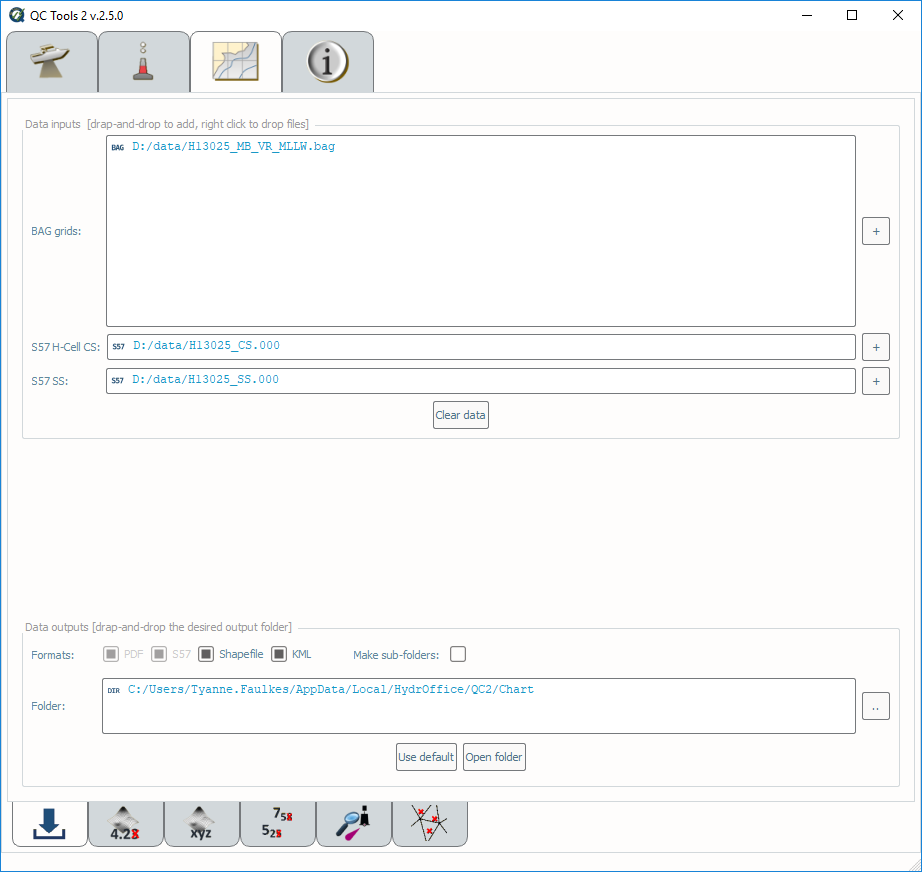
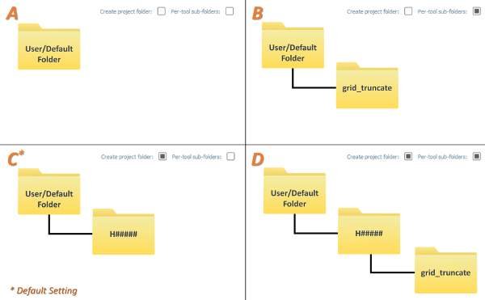

.. _chart-data-inputs-label:

Data inputs
-----------

Ingest bathymetric grid(s) (.bag), a feature file (.000), and a (dense) survey soundings selection (.000).

.. index::
    single: chart review

* Select the **Chart Review** tab on top of the QC Tools interface.

.. index::
    single: drag-and-drop
    single: data; browsing
    single: bag

In **Data inputs:**

* Drag-and-drop any number of grids (.bag only) onto the Grid files field. The **\"+\"** browse button may also be used.

* Drag-and-drop a feature file (.000 only) onto the S57 CS file field. The **\"+\"** browse button may also be used. Note that this feature file must also contain the CS soundings.

* Drag-and-drop a dense, survey sounding selection (.000 only) onto the SS file field. The **\"+\"** browse button may also be used. 

* The directory and filename of loaded data will populate in the respective field of **Data inputs**.

* With the addition of a grid, feature file, and survey sounding selections, the **Grid truncate**, **Grid xyz**, **S57 truncate**, **Triangle Rule**, and/or **Scan Features** tabs
  on the bottom of the interface will become available (:numref:`chart`).

.. _chart:

    Chart review tab.

.. index::
    single: data; clear

* The **Clear data** button may be used to remove all data inputs.

.. index::
    single: data; folder

In **Data outputs:**

* The output **Formats** may be customized. The user has the option to suppress **Shapefile** and **KML** output.

* Output files location is controlled by the **Create project folder** and **Per-tool sub-folder** flags. The four available combinations are:

  * No flags set (see :numref:`chart_folder_structure`, pane A). The outputs are stored directly under the default or user-defined location.
  * Only the **Per-tool sub-folders** flag set (see :numref:`chart_folder_structure`, pane B). The outputs are stored in a tool-specific sub-folder (in the default or user defined-location).
  * Only the **Create project folder** flag set (see :numref:`chart_folder_structure`, pane C). The outputs are stored in a survey folder (in the default or user defined-location). *This is the default setting.*
  * Both flags set (see :numref:`chart_folder_structure`, pane D). The outputs are stored in tool-specific sub-folders in a survey folder (in the default or user defined-location).

.. _chart_folder_structure:

    The resulting folder structure based on the four available combinations of output flags.

* The default output **Folder** location is listed; however, this may be modified via drag-and-drop (or browse to) a user-specified output folder. To return to the default output folder location, click **Use default**.

* The ensuing functions will open the output folder automatically upon execution;  however, if needed, the specified output folder may be accessed by clicking the **Open folder** button.
