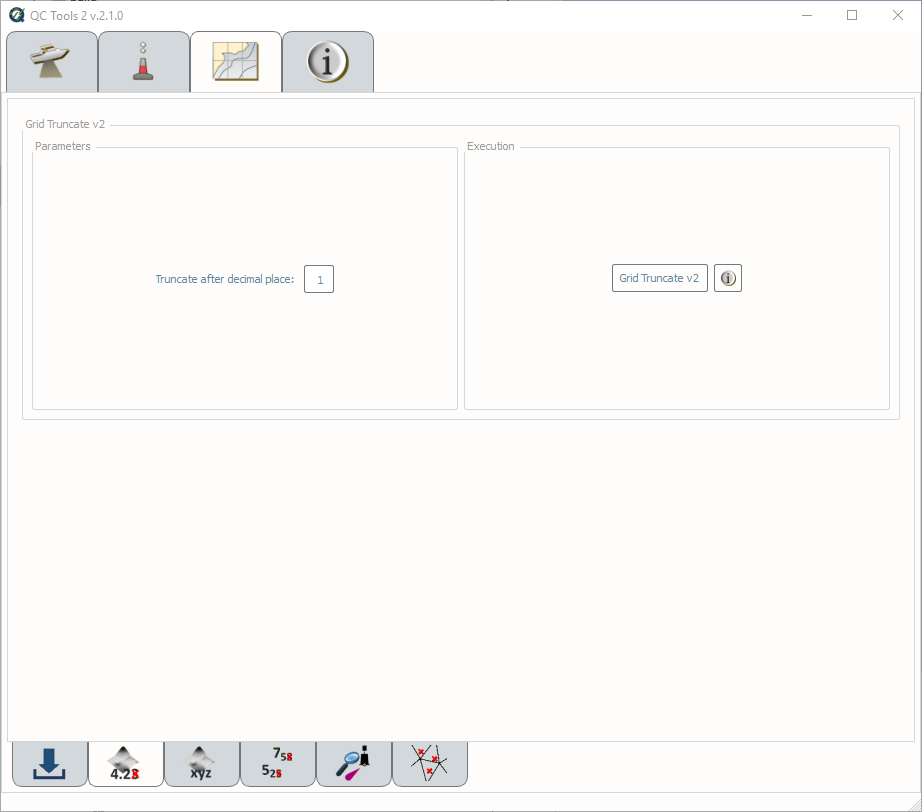
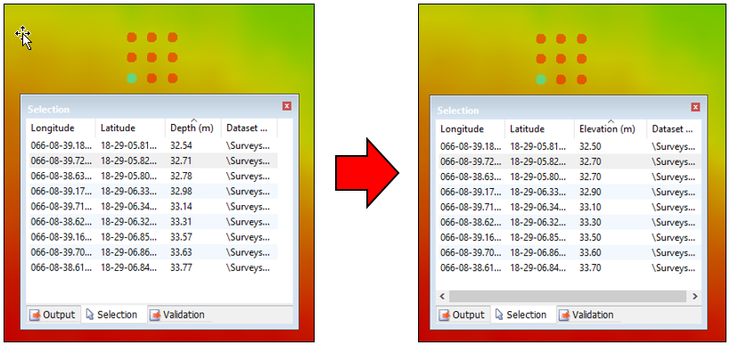

.. _grid-truncate-label:

Grid truncate
-------------

.. index::
    single: Grid truncate

How To Use?
^^^^^^^^^^^

Truncate grid elevation to decimetric precision.

* Select the **Grid truncate** tab on the bottom of the QC Tools interface.

* Define the decimal place of the truncation (default is 1, thus decimetric truncation).

* In **Execution** (:numref:`fig_grid_truncate`), click **Grid Truncate v2**.

.. _fig_grid_truncate:

    Grid truncate's interface.

* After computing, the output window opens automatically, and the truncated BAGs are ready to use for chart compilation.

|

-----------------------------------------------------------

|

How Does It Work?
^^^^^^^^^^^^^^^^^

All elevation values in the grid are truncated to decimetric precision, as shown in the example below. The truncation to decimeter precision facilitates creation of the HCell (per 2016 HCell Specification units and precision).

