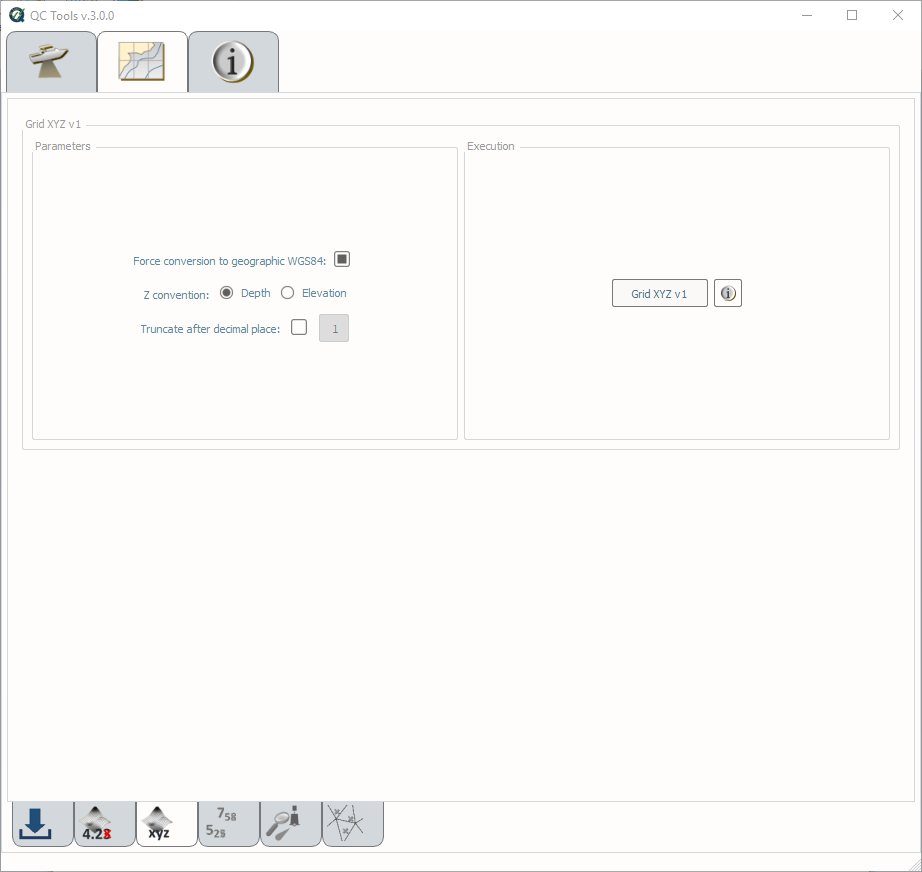

.. _grid-xyz-label:

Grid xyz
--------

.. index::
    single: grid xyz

How To Use?
^^^^^^^^^^^

Export elevation values as a point cloud.

* Select the **Grid xyz** tab on the bottom of the QC Tools interface.

* Check the **Force conversion to geographic WGS84** checkbox if you want the output coordinates converted to geographic. 

* In **Execution** (:numref:`fig_grid_xyz`), click **Grid XYZ v1**.

.. _fig_grid_xyz:

    Grid XYZ's interface.

* After computing, the output window opens automatically.

|

-----------------------------------------------------------

|

How Does It Work?
^^^^^^^^^^^^^^^^^

A text file with three columns is created.

