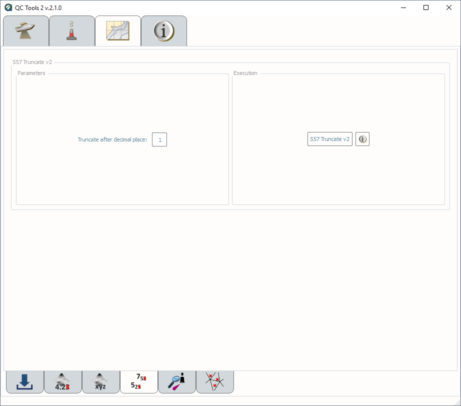
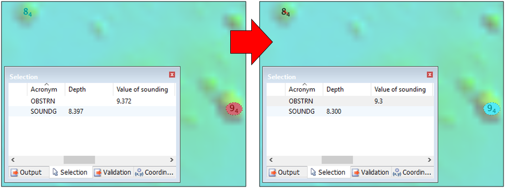

.. _s57-truncate-label:

S57 truncate
------------

.. index::
    single: S57 truncate

How To Use?
^^^^^^^^^^^

Truncate all "z" values in a feature file (.000) to decimetric precision.

To access this tool, load an S-57 (.000) file into the S57 H-Cell CS box in the **Data Inputs** tab. 

* Select the **S57 truncate v1** tab on the bottom of the QC Tools interface.

* Define the decimal place of the truncation (default is 1, thus decimetric truncation).

* In **Execution** (:numref:`s57_truncate`), click **S57 Truncate v2**.

.. _s57_truncate:

    S57 Truncate.

* After computing, the output window opens automatically, and the truncated feature file is ready to use for chart compilation.

|

-----------------------------------------------------------

|

How Does It Work?
^^^^^^^^^^^^^^^^^

All "z" values in the feature file are truncated to decimetric precision, as shown in the example in (:numref:`s57_truncate_example`).
The truncation to decimeter precision facilitates creation of the HCell (per 2016 HCell Specification units and precision).

.. _s57_truncate_example:

    S57 Truncate's example.

The S57 attributes that will be truncated are listed below.

For **SOUNDG** objects: 

* **Depths**

For **all** objects:

* Value of Sounding (**VALSOU**)

* Height (**HEIGHT**)

* Value of depth contour (**VALDCO**)

* Depth range value 1 (**DRVAL1**)

* Depth range value 2 (**DRVAL2**)
