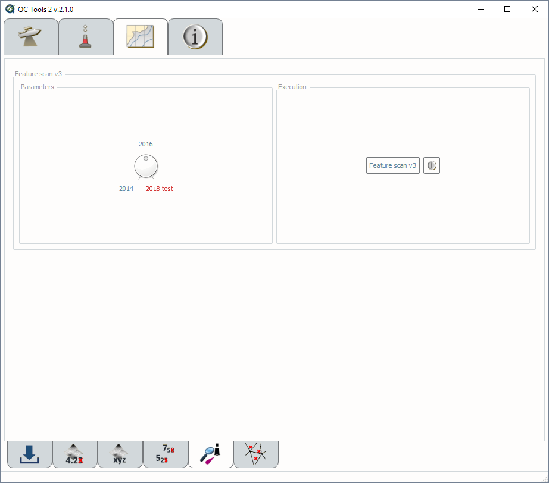
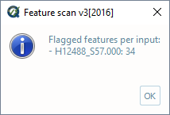

.. _chart-scan-features-label:

Scan features
-------------

.. index::
    single: features

How To Use?
^^^^^^^^^^^

Scan features to ensure proper attribution and cartographic disposition.

* Select the **Scan Features** tab on the bottom of the QC Tools interface.

* In **Parameters** (:numref:`S57_feature_scan`, left side), turn the knob to select the required year of HCell Specification. Currently, the '2018 test' is duplicative to 2016.

* In **Execution** (:numref:`S57_feature_scan`, right side), click **Feature scan v2**.

.. _S57_feature_scan:

    Feature scan's interface.

* After computing, the output window opens automatically, and the results are shown (:numref:`S57_feature_output`).

.. _S57_feature_output:

    Feature scan's output message.

* From the output window, drag-and-drop the output into the processing software to guide the review.

* In addition, the results are printed to PDF for a documented summary.

|

-----------------------------------------------------------

|

How Does It Work?
^^^^^^^^^^^^^^^^^

The S-57 features are scanned to ensure proper attribution and chart disposition per the required year of HCell Specification. Listed within the specification are mandatory requirements and S-57 attribution.

The QC Tools Chart feature scan will ensure the following:

* No **redundant features**.

* **CS Soundings** have an accompanying **SS Sounding**.

* All feature **VALSOU** have an accompanying **SS Sounding**.

* No feature **VALSOU** coincide with a **CS Sounding**.

* No **objects** have prohibited attribute **SCAMIN**.

* No **objects** have prohibited attribute **RECDAT**.

* No **objects** have prohibited attribute **VERDAT**.

* All **objects** have mandatory attribute **NINFOM**. [1]_ [2014]_

* All **objects** have **SORIND**. [2]_

* All **objects** have **SORDAT**. [2]_

* No **SOUNDG** have prohibited attribute **STATUS**.

* All **Wrecks** must have mandatory attributes **CATWRK, WATLEV, VALSOU,** and **QUASOU**.

* All **Wrecks** with **WATLEV** = 5 (**awash**) must have mandatory attribute **EXPSOU**. [2016]_

* All **UWTROC** must have mandatory attributes **VALSOU, WATLEV,** and **QUASOU**.

* All **OBSTRN** must have mandatory attributes **VALSOU, WATLEV,** and **QUASOU**.

* No **OBSTRN** with **CATOBS** =6 (**foul area**). [2014]_

* All **MORFAC** must have mandatory attribute **CATMOR**.

* No **MORFAC** have prohibited attributes **BOYSHP, COLOUR,** or **COLPAT**. [2016]_

* All **SBDARE** points must have mandatory attribute **NATSUR**.

* No **SBDARE** points have prohibited attributes **COLOUR** or **WATLEV**.

* All **SBDARE** points have an allowable combination of **NATSUR** and **NATQUA** noted by 'x' in the table below.

+----------+---+---+---+---+---+---+---+---+---+---+
|**NATQUA**| 1 | 2 | 3 | 4 | 5 | 6 | 7 | 8 | 9 | 10|
+-----+----+---+---+---+---+---+---+---+---+---+---+
|     |  1 |   |   |   |   | o | o | o | o | o | o |
+     +----+---+---+---+---+---+---+---+---+---+---+
|     |  2 |   |   |   |   | o | o | o |   |   | o |
+     +----+---+---+---+---+---+---+---+---+---+---+
|     |  3 |   |   |   |   | o | o | o |   |   | o |
+     +----+---+---+---+---+---+---+---+---+---+---+
|**N**|  4 | o | o | o |   |   | o |   | o | o | o |
+     +----+---+---+---+---+---+---+---+---+---+---+
|**A**|  5 |   |   |   |   |   |   |   | o | o |   |
+     +----+---+---+---+---+---+---+---+---+---+---+
|**T**|  6 |   |   |   |   |   |   |   | o | o |   |
+     +----+---+---+---+---+---+---+---+---+---+---+
|**S**|  7 |   |   |   |   |   |   |   | o | o |   |
+     +----+---+---+---+---+---+---+---+---+---+---+
|**U**|  8 |   |   |   |   |   |   |   | o | o |   |
+     +----+---+---+---+---+---+---+---+---+---+---+
|**R**|  9 |   |   |   |   |   |   |   | o | o |   |
+     +----+---+---+---+---+---+---+---+---+---+---+
|     | 11 |   |   |   |   |   |   |   | o |   |   |
+     +----+---+---+---+---+---+---+---+---+---+---+
|     | 14 |   |   |   | o |   |   |   |   |   |   |
+     +----+---+---+---+---+---+---+---+---+---+---+
|     | 17 |   |   |   | o |   |   |   |   | o |   |
+     +----+---+---+---+---+---+---+---+---+---+---+
|     | 18 |   |   |   |   |   |   |   | o | o |   |
+-----+----+---+---+---+---+---+---+---+---+---+---+

**NATQUA**: fine (1), medium (2), coarse(3), broken (4), sticky (5) soft (6), stiff (7), volcanic (8), calcareous (9), hard (10)

**NATSUR**: mud (1), clay (2), silt (3), sand (4), stone (5), gravel (6), pebbles (7), cobbles (8), rock (9), lava (11), coral (14), shells (17), boulder (18)

* All **SBDARE** lines and areas must have mandatory attribute **NATSUR** and **WATLEV**.

* All **COALNE** must have mandatory attribute **CATCOA**.

* No **COALNE** have prohibited attribute **ELEVAT**.

* All **CTNARE** must have mandatory attribute **INFORM**. [2016]_

* All **SLCONS** must have mandatory attribute **CATSLC**.

* All **M_QUAL** must have mandatory attributes **CATZOC, TECSOU, SURSTA,** and **SUREND**.

* All **M_CSCL** must have mandatory attribute **CSCALE**.

* All **M_COVR** must have mandatory attribute **CATCOV**.

* All **cartographic objects** must have mandatory attributes **NINFOM** and **NTXTDS**. [3]_ [2014]_

* All **cartographic objects** must have mandatory attribute **INFORM**. [3]_ [2016]_

* All objects with **NOAA extended attributes** still populated are tallied and presented (display only) as a reminder to clear before final submission.

.. rubric:: Footnotes

.. [1] Excludes **SOUNDG, M_COVR, M_QUAL, M_CSCL,** and **DEPARE**.
.. [2] **2016** excludes **LNDARE, DEPARE, and DEPCNT** from the check for **SORIND** and **SORDAT**.
.. [3] Cartographic objects include **$CSYMB, $LINES,** and **$AREAS**.
.. [2014] Only for 2014 HCell Specification
.. [2016] Only for 2016 HCell Specification
