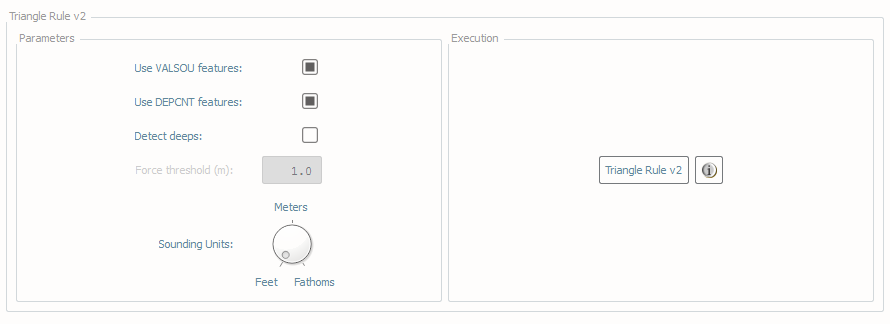
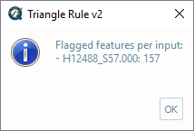
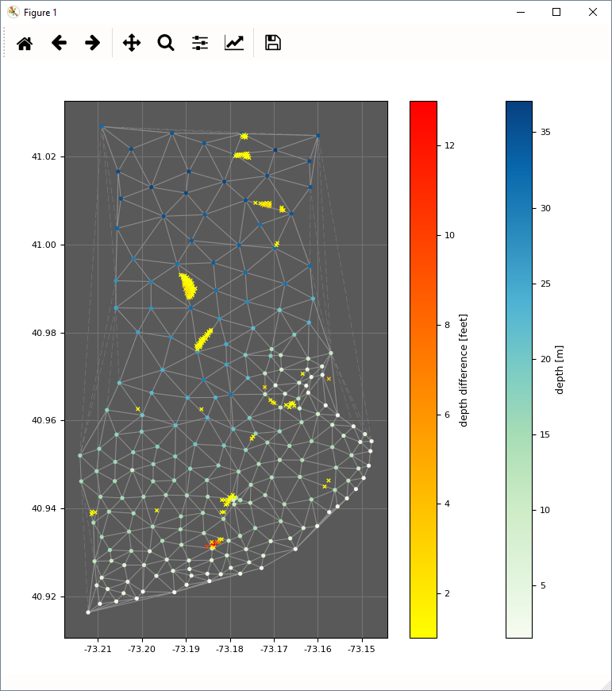
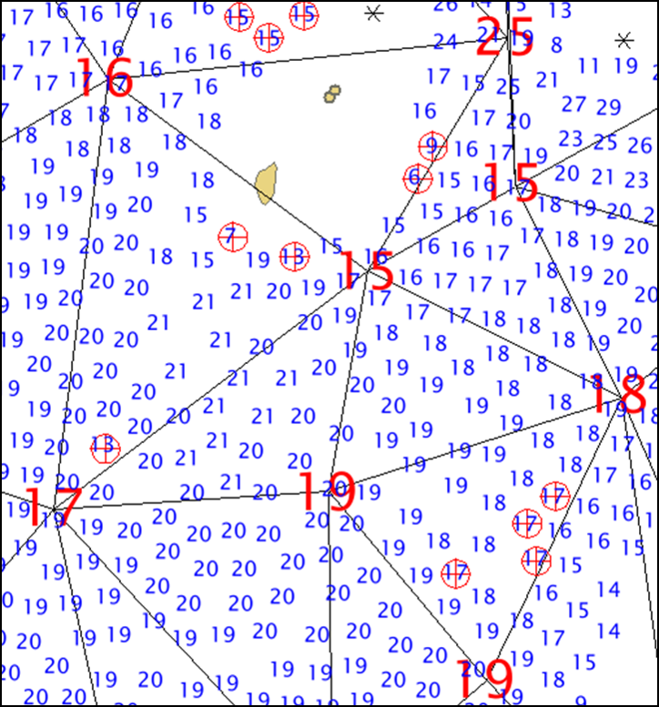

.. _chart-triangle-rule-label:

Triangle rule
-------------

.. index::
    single: Triangle rule

How To Use?
^^^^^^^^^^^

Evaluate chart-scale soundings and feature versus survey-scale soundings via "triangle rule".

* Select the **Triangle Rule** tab on the bottom of the QC Tools interface.

* In **Parameters** (:numref:`triangle_rule`, left side):

    * Check the **Use VALSOU features** checkbox if you wish for any feature VALSOUs to be included with the chart-scale soundings in the evaluation.
    * Check the **Use DEPCNT features** checkbox if you wish that points from the DEPCNT features are included with the ENC soundings in the evaluation.
    * Set the **Force threshold (m)** value to set a minimum threshold in meters (only active when **Meters** units are selected)
    * Check the **Detect deeps** checkbox if you want that the deep discrepancies are also evaluated.
    * Turn the knob to the applicable chart units.

* In **Execution** (:numref:`triangle_rule`, right side), click **Triangle Rule v2**.

.. _triangle_rule:

    Triangle rule's interface.

* After executing, the output window opens automatically, and the results are shown by textbox (:numref:`triangle_rule_output`).

.. _triangle_rule_output:

    Triangle rule's output message.

* After executing, the results are also shown graphically (:numref:`triangle_rule_display`). Chart-scale soundings are colored by depth, and flagged survey-scale soundings that may not be adequately represented are colored by their discrepancy.

.. _triangle_rule_display:

    Triangle rule's output display.

* From the output window, drag-and-drop the output into the processing software to guide the review.

* Note the output consists of both a TIN (triangulated irregular network) of the chart-soundings (and feature value of soundings, if included) and flags atop survey-scale soundings that may not be appropriately accounted for by the prospective chart-soundings.

* The magnitude of the discrepancy against the chart-scale soundings is printed to the S57 attribute NINFOM, for easy sorting and identification of the most significant discrepancies.

|

-----------------------------------------------------------

|

How Does It Work?
^^^^^^^^^^^^^^^^^

A TIN is created from the chart-scale soundings (and feature value of soundings, if included). The survey-scale soundings are categorized within the triangles of the TIN, and if any survey-scale sounding is shoal of the three vertices of the triangle it falls within, it is flagged. The flags might alert a cartographer to survey-scale soundings that may not be adequately represented by the chart-scale soundings.

The shoal determination factor is based on sounding rounding of the chart unit. For example, survey-scale soundings that are shoal of the chart-scale soundings are only flagged if the difference is more than a chart scale unit (either in feet or fathoms, as prescribed in the parameters).

Note that, if the sounding unit is set to meters, then the difference in depth is evaluated againt the **Force threshold (m)** value.

In the example in :numref:`triangle_rule_example`, the shoal soundings flagged by the red circles may need additional consideration by the cartographer; in particular, the 13 foot sounding in the southwest (near the 17 foot chart sounding) could be dangerous to navigation if not better represented.

.. _triangle_rule_example:

    Triangle rule's example.
