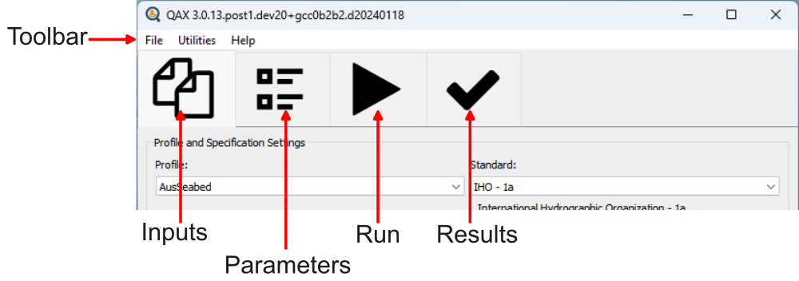

.. _interface:

Interface
==========

.. index::
    single: User Manual

The QAX user interface is broken down into a toolbar where general application functions
are available, and a series of tabs that can be stepped through to process data within QAX.

.. _interface_figure:

    QAX User Interface

The File item on the toolbar provides options to save and load QAJSON (a record
of QAX inputs and results from a previous run), feature to export QAX results to
an Excel file, and access to QAX settings.

Generally when processing data within QAX the user will step through each of
the four tabs from left to right.

* :ref:`Inputs`: specify profile and standard that should be applied to input files. This includes specifying which check tools should be run.
* :ref:`Parameters`: overide the default check input parameter values (optional).
* **Run:** start the processing, select which optional outputs should be created.
* **Results:** view results of QAX processing.

Consult the following sections for more details on each of these tabs.

.. toctree::
    :maxdepth: 5

    user_manual_interface_inputs
    user_manual_interface_parameters
