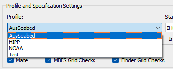
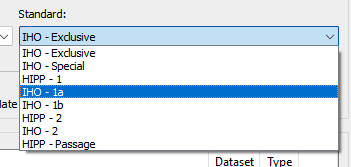
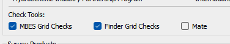

.. _inputs:

Inputs
=======

Profile
--------

QAX Profiles group a collection of check tools and specifications that
define default sets of parameters values for each of the check tools.
Selecting a profile will change both the list of standards available and
what check tools can be selected.

Profiles are included within QAX to better support unique groups of users. For
example; the AusSeabed profile includes all available check tools for raw 
bathymeyry data (soundings) and gridded data. The HIPP profile only includes
the grid based check tools as performing QA checks on raw data is not a priority
for this user group.

.. _standard:

Standard
---------

The standards available for each profile also vary. The HIPP profile includes
a number of HIPP specific standards, and also includes IHO standards. Selecting
a standard will change the default check tool parameter values as shown on
the :ref:`parameters` tab.

Check Tools
------------

The list of available check tools may change depending on which profile
is selected. Each check tool implements one or more checks, for example the
MBES Grid Checks tool implements the density, resolution, and total vertical
uncertainty check. Checks from each check will only be run if ticked in the
check tools list (shown below).

