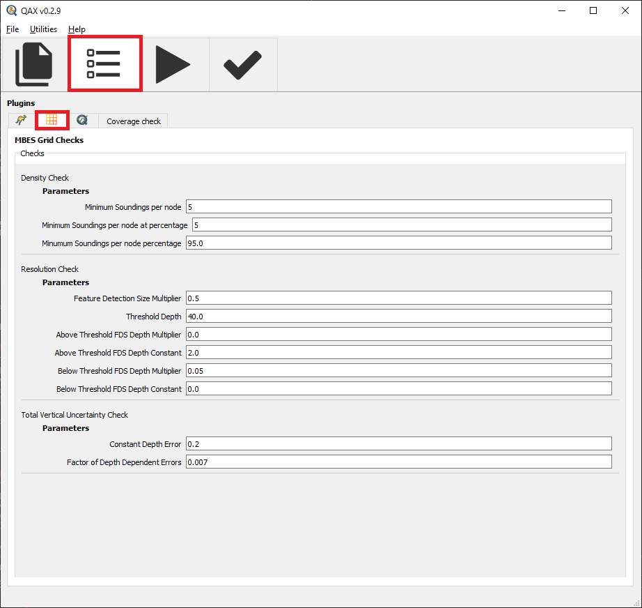
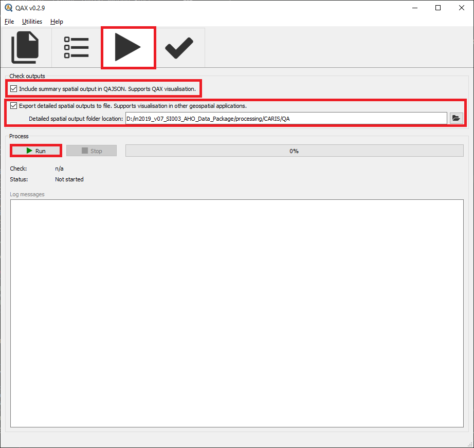
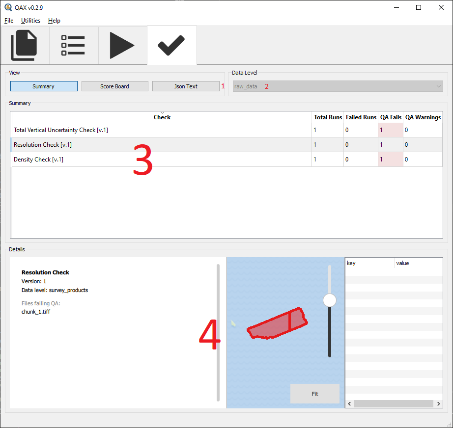

.. _qax-MBESGC:

MBESGC
============

.. index::
    single: MBESGC

MBESGC stands for Multibeam Echo Sounder Grid Checks. These grid checks include the following functions:

* Density grid checks
* Total Vertical Uncertainty grid check
* Resolution check

Inputs
-----------------------------------------
Processed multibeam grid files can be used as input to the MBESGC plugin in QAX
File type supported by the current version:

**Single band GeoTIFF (.tiff, .tif)**

QAX will accept several single GeoTIFF files that make up a single dataset where
each file includes a specific band as listed below.

QAX uses two methods to determine what file provides which band. First it will read
the band name from the GeoTIFF metadata and match against the below list. If there
is no band name in the metadata it will look for the inclusion of the band name 
in any part of the filename.

+-------------------+
|**Bands**          |
+-------------------+
| Depth             |
+-------------------+
| Density           |
+-------------------+
| Uncertainty       |
+-------------------+

**Multiband GeoTIFF (.tiff, .tif)**

Multiband GeoTIFF can store several gridded data layers within a single file. Not
all the following bands are required, however some checks may be aborted if the
necessary layers are not present. For example the density check will be aborted if
no density layer is included in the multiband GeoTIFF.

QAX reads the following band names from the metadata included in the GeoTIFF file.
You may need to ensure the tool that has exported the GeoTIFF include these band
names.

+-------------------+
|**Bands**          |
+-------------------+
| Depth             |
+-------------------+
| Density           |
+-------------------+
| Uncertainty       |
+-------------------+

    .. note::
        The band band names must be included in the tif file metadata to be correctly \
        identified by QAX.

Checks
-----------------------------------------

Density grid check
^^^^^^^^^^^^^^^^^^^^^^

This function conducts a check of the number of soundings attributed to individual 
nodes within a surface and allows the user to set and test for a minimum threshold 
of soundings per node at a given aggregate for the surface.

There are two parameters that can be changed to modify the Density Grid check

.. _mbesgc_density_params:

================================================  ====================================
Parameter                                         Description
================================================  ====================================
Minimum Soundings per node (mspn)                 The minimum number of soundings required per node. If the minimum soundings for a node is not met, the node will register as a fail. The default for this parameter is 5 soundings per node, or what is specified by the selected :any:`standard <standard>`.
Minimum Soundings per node percentage (mspp)      The aggregate number of nodes that are required to pass for the surface to be deemed as a pass overall - expressed as a percentage. The default for this parameter is 95%.
================================================  ====================================

Using an example of how to set these parameters based on an IHO Order 1a survey \
which requires 9 soundings to contribute to each grid node across 100% of the \
grid nodes.  In this example the settings required are:

================================================  ====================================
Parameter                                         Value
================================================  ====================================
Minimum Soundings per node (mspn)                 9
Minimum Soundings per node at percentage (mspna)  100
================================================  ====================================

The Density layer from your grid is then compared to the minimum sounding \
per node value with 100% of nodes required to have >9 soundings in order to pass

Total Vertical Uncertainty grid check
^^^^^^^^^^^^^^^^^^^^^^^^^^^^^^^^^^^^^^^^

This function calculates whether maximum allowable Total Vertical Uncertainty (TVU)
requirements have been exceeded across nodes within the supplied surface.

The maximum allowable TVU per node is calculated using the following equation from
IHO S44:

.. math:: TVU Error Limit = sqrt[a^2+(b*d)^2]

Where:
**a** represents that portion of the uncertainty that oes not vary with the depth
**b** is a coefficient which represents that portion of the uncertainty that varies with the depth
**d** is the depth 

The relationship between the parameters in the Total Vertical Uncertainty Check
calculation and the IHO S44 equation above is as follows:

.. _mbesgc_tvu_params:

=========================================  ====================================
Parameter                                  Description
=========================================  ====================================
Constant Depth Error (a)                   Sum of all constant errors in meters
Factor of Depth Dependant Errors (b)       Multiplied by depth layer and is the sum of all depth dependant errors.
Acceptable Area Percentage                 The threshold for achieving a 'pass' for number of nodes which do not exceed the maximum allowable TVU - expressed as a percentage.
=========================================  ====================================

.. note::
        Depth component of equation is obtained from the depth layer of the input surface.

Using an example of how to set these parameters based on an IHO Order 1a survey \
which requires a=0.5m and b=0.013

=========================================  ====================================
Parameter                                  Description
=========================================  ====================================
Constant Depth Error (a)                   0.5
Factor of Depth Dependant Errors (b)       0.013
=========================================  ====================================

The resulting calculated values would then be compared to he Uncertainty layer \
from your grid and if all Uncertainty nodes are less than the TVU error limit \
the check will pass

Resolution grid check
^^^^^^^^^^^^^^^^^^^^^^^^^^^^^^^^^^^^^^^^

This function will inform whether a supplied surface has been produced at the
required resolution (spacing between surface nodes) with respect to the observed
depths within the surface.

There are two main categories for IHO S44 minimum feature detection requirements -
a fixed minimum feature detection size in depths less than 40m; and a feature
size that scales according to the observed depth for depths greater than 40m. 
This function uses linear equations to address these standards and can altered
to address other thresholds as required.

The linear equations are:

.. math:: Resolution requirement for < threshold depth
.. math:: DSM * (ADM * Depth + ADC)
.. math:: Resolution requirement for > threshold depth
.. math:: DSM * (BDM * Depth + BDC)

.. _mbesgc_resolution_params:

==========================================  ======================================
Parameter                                   Description
==========================================  ======================================
Feature Detection Size Multiplier (DSM)     Feature Detection Size Multiplier. This allows for the user to determine the resolution of the surface with respect to the minimum feature detection size - default is 0.5 of the minimum feature detection size.
Threshold Depth                             Depth threshold for linear equations - default is 40 metres to reflect IHO S44 standard.
Above Threshold FDS Depth Multiplier (ADM)  Above Threshold FDS Depth Multiplier. This component is the part of the equation which will scale the minimum feature detection size for depths less than the threshold depth - default is 0 as this is typically the requirement in depths less than the threshold depth.
Above Threshold FDS Depth Constant (ADC)    Above Threshold FDS Depth Constant. This component describes the minimum feature detection size in depths less than the Threshold Depth, this will be scaled by the ADM component.
Below Threshold FDS Depth Multiplier (BDM)  Below Threshold FDS Depth Multiplier. This component is the part of the equation which will scale the minimum feature detection size for depths greater than the threshold Depth - default is 0.05 as this is typically the requirement in depths greater than the threshold depth for IHO S44.
Below Threshold FDS Depth Constant (BDC)    Below Threshold FDS Depth Constant. This component describes the minimum feature detection size in depths greater than the Threshold Depth, this will be scaled by the BDM component.
==========================================  ======================================

Using an example of how to get these parameters to work for an IHO Order 1a survey 
which requires:
Half the feature detection size
Shallower than a threshold depth of 40m a constant 2m feature detection size
Deeper than a threshold depth of 40m 5% of depth feature detection size is as follows

.. math:: Resolution requirement for < threshold depth
.. math:: 0.5 * (0 * Depth + 2)
.. math:: Resolution requirement for > threshold depth
.. math:: 0.5 * (0.05 * Depth + 0)

Outputs
-----------------------------------------

The outputs vary depending on the grid check that is run

Density grid check
^^^^^^^^^^^^^^^^^^^^^^

QAJSON output object that contains:

+------------------+--------------------------+
|**Parameter**     |**Description**           |
+------------------+--------------------------+
|execution         |- Start time of execution |
|                  |- End time of execution   |
|                  |- Execution status        |
|                  |- Execution error         |
+------------------+--------------------------+
|**messages**      |Output messages describing|
|                  |the results of the check  |
|                  |(see below for detail)    |
+------------------+--------------------------+                     
|**data**          |Data output for the check |
|                  |(see below for detail)    |
+------------------+--------------------------+
|check_state       |- pass                    |
|                  |- warning                 |
|                  |- fail                    |
+------------------+--------------------------+

| **messages**:
| For this check the messages can be one of:
| **?** nodes were found to be under the Minimum Soundings per node setting (**mspn**)
| where the **?** is a count of the nodes that were under the threshold and **mspn** is minimum soundings per node parameter setup by the user
| 
| **?**\% of nodes were found to have a sounding count above **mspna**. This is required to be **mspp**\% of all nodes
| where the **?** is a percentage of the  total nodes that were under the threshold and **mspna** entered by the user.  **mspp** is the required percentage entered by the user
| 
| **data**:
| For this check the data is a dictionary containing the keys:
| 1. chart: for future use contains dictionary of type and data.  in this case type is histogram with data containing counts of density values in the nodes in the input data
| 2. map: geographic tiles for the map widget display

Total Vertical Uncertainty grid check
^^^^^^^^^^^^^^^^^^^^^^^^^^^^^^^^^^^^^^^

QAJSON output object that contains:

+------------------+--------------------------+
|**Parameter**     |**Description**           |
+------------------+--------------------------+
|execution         |- Start time of execution |
|                  |- End time of execution   |
|                  |- Execution status        |
|                  |- Execution error         |
+------------------+--------------------------+
|**messages**      |Output messages describing|
|                  |the results of the check  |
|                  |(see below for detail)    |
+------------------+--------------------------+                     
|**data**          |Data output for the check |
|                  |(see below for detail)    |
+------------------+--------------------------+
|check_state       |- pass                    |
|                  |- warning                 |
|                  |- fail                    |
+------------------+--------------------------+

| **messages**:
| For this check the messages is:
| **?** nodes failed the TVU check this represents **x**\% of all nodes within data.
| where the **?** is a count of the nodes that failed to meet the calculated TVU threshold which is **x** percent of the overall nodes in the input data
| 
| **data**:
| For this check the data is a dictionary containing the keys:
| 1. failed_cell_count: count of failed nodes in the input data
| 2. total_cell_count: total number of nodes in the input data
| 3. fraction_failed: failed_cell_count \\ total_cell_count
| 4. map: geographic tiles for the map widget display

Resolution of grid check
^^^^^^^^^^^^^^^^^^^^^^^^^^^^^^^^^^^^^^^

QAJSON output object that contains:

+------------------+--------------------------+
|**Parameter**     |**Description**           |
+------------------+--------------------------+
|execution         |- Start time of execution |
|                  |- End time of execution   |
|                  |- Execution status        |
|                  |- Execution error         |
+------------------+--------------------------+
|**messages**      |Output messages describing|
|                  |the results of the check  |
|                  |(see below for detail)    |
+------------------+--------------------------+                     
|**data**          |Data output for the check |
|                  |(see below for detail)    |
+------------------+--------------------------+
|check_state       |- pass                    |
|                  |- warning                 |
|                  |- fail                    |
+------------------+--------------------------+

| **messages**:
| For this check the messages can be one of:
| **?** nodes failed the resolution check this represents **x**\% of all nodes within data.
| where the **?** is a count of the nodes that failed to meet the calculated resolution threshold which is **x** percent of the overall nodes in the input data
| 
| **data**:
| For this check the data is a dictionary containing the keys:
| For this check the data is a dictionary containing the keys:
| 1. failed_cell_count: count of failed nodes in the input data
| 2. total_cell_count: total number of nodes in the input data
| 3. fraction_failed: failed_cell_count \\ total_cell_count
| 4. map: geographic tiles for the map widget display

   .. note::
        If the checks pass no messages will be created

Interface
-----------------------------------------
Upon initial opening of the QAX interface two windows will open.  One is a console window that provides 
extra information and assists with debugging, the other is the main graphical user interface (GUI).

.. _console:
.. figure:: _static/console_qax.png
    :width: 1000px
    :align: center
    :alt: console
    :figclass: align-center

    Console window

.. _QAX_Interface:
.. figure:: _static/interface_qax.png
    :width: 1000px
    :align: center
    :alt: initial interface
    :figclass: align-center

    Initial QAX GUI interface
    
The initial tab that is opened when QAX is started in the input tab.  A breakdown of the tab is explained
below

.. _QAX_input_breakdown:
.. figure:: _static/mbesgc_qax.png
    :width: 1000px
    :align: center
    :alt: input breakdown
    :figclass: align-center

    QAX GUI input breakdown
    
When the MBES Grid Checks plugin is selected, the QAX interface will change to show the inputs
that work with the plugin.  As shown in the screenshot, it is Survey DTM's.

#. Check tools - Used to select the plugin you want to run in this case MBES Grid Checks
#. Folder icon - Used to select the surface files you want to check.  Will open independent popup for selection
#. Remove file - you can remove files and of the x buttons not highlighted or the clear all files button
    .. note::
        Profile selection is not implemented in the current version of QAX
        
After the gridded files have been added into the QAX interface navigate to the plugins tab

.. _QAX_plugins_breakdown:

    QAX GUI parameters breakdown
    
The parameters are as follows:

Density Check

#. Minimum Soundings per node - Minimum number required in density layer of density layer of gridded surface
#. Minimum Soundings per node percentage - Percentage of cells required to pass with the minimum number from above

Resolution Check

#. Feature detection size multiplier - Multiplier to scale the feature detection size
#. Threshold depth - Depth threshold to dictate when to use above and below parameters below
#. Above threshold FDS depth multiplier - Multiplier of depth to calculate feature detection size above threshold depth
#. Above threshold FDS depth constant - Constant added to above to calculate feature detection size above threshold depth
#. Below threshold FDS depth multiplier - Multiplier of depth to calculate feature detection size below threshold depth
#. Below threshold FDS depth constant - Constant added to above to calculate feature detection size above threshold depth

Total Vertical Uncertainty Check

#. Constant depth error - Constant depth error (a) for total vertical uncertainty check
#. Factor of depth dependant errors - Factor of depth dependant errors (b) for total vertical uncertainty check
    
.. _QAX_run_checks_breakdown:

    QAX GUI run checks breakdown

To run the QAX checks on your data files press the play button.  The check that is being
run will be shown on the display as well as the status.  Logging messages will provide
further information and time taken to run the checks.

#. Check outputs - The two checkboxes enable different outputs from QAX on MBES grid checks
    - Include summary spatial output in QAJSON - enables visualisations within the QAX GUI.  This can be used with all plugins
    - Export detailed spatial outputs to file - enables GeoTIFF and shapefile output able to be ingested into other geospatial applications
        * These outputs include different outputs for each different check which includes areas that have failed checks
        * Raster data containing the calculation results for comparison and analysis in other geospatial applications

.. _External_application_example:
.. figure:: _static/allowable_uncertainty_comparison.png
    :width: 500px
    :align: center
    :alt: external_app
    :figclass: align-center

    Example of TVU check comparison in external application.  This example was inverted by the external application.  \
    In this case the cell would pass the check with Uncertainty of 0.506 being less than the absolute value of -1.040

.. _QAX_view_results_breakdown:

    QAX GUI view results breakdown
    
#. View Selection - Choose between a summary of all data, score board view to look at the individual line level or QAJSON output
    - Summary gives a summary of the overall check results, i.e. a count of the lines pass, fail or warning
    - Scoreboard enables viewing of results per file
    - JSON text is a raw printout of the QAJSON created after running the checks
#. Data Level - Automatically updates on summary view but is selectable on scoreboard view.  Options are:
    - raw_data
    - survey_products
#. Check Selection - Choose the check you want to view in the details view
#. Details - Details is a subsection of the view part of the window.  It will change depending on what you select within the view pane
    - As an example selecting the summary view --> summary item for density check will display a geographic map of where this check has failed
    - If you then select the scoreboard view of the same check you will then be able to see the total number of cells, \
      number of cells failing, percentage of cells failing and the resolution of the surface
