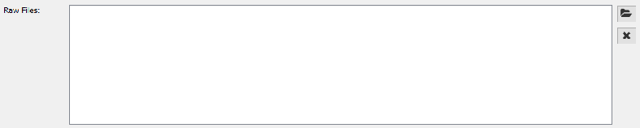
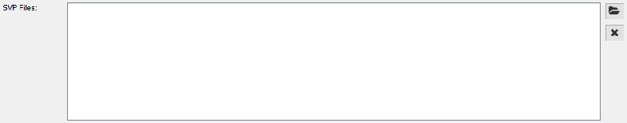
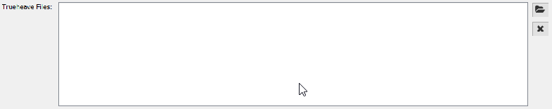
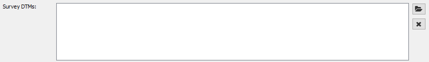

.. _qax-data-inputs:

Data inputs
============

Raw Files
-----------------------------------------
Currently raw multibeam files can be used as input to the mate plugin in QAX
The only supported inputs in the current version of QAX are kongsberg .all, 
.kmall files and generic sensor format .gsf files

.. _raw_files:

    Raw file input box
    
SVP Files
-----------------------------------------
Currently raw svp files are able to entered in any format
Entry of SVP files is for tracking folder structure and files only

.. _svp_files:

    SVP file input box

TrueHeave Files
-----------------------------------------
Currently delayed calculated heave files are able to entered in any format
Entry of delayed calculated heave files is for tracking folder structure and files only

.. _trueheave_files:

    Delayed Heave file input box

Survey DTM Files
-----------------------------------------
Currently survey DTM files can be input to the MBESGC and Finder plugins in QAX
The only supported inputs in the current version of QAX geotiff, .tiff or .tif
and BAG (Bathymetry Attributed Grid) .bag format.  The following requirements need
to be met for input grids:
    
+-------------------+
|**Bands Required** |
+-------------------+
| Depth             |
+-------------------+
| Density           |
+-------------------+
| Uncertainty       |
+-------------------+

One multiband geotiff must only contain the above bands named correctly.

Two BAG files are required one with main band depth and the other with
a main band containing sounding density.

Some processing software may not
enable this as such it is recomended to create multiband geotiff in most
circumstances until further work has been put into the BAG format specification
to enable density metadata within a single file.  We have implemented BAG
functionality for future use and is available however.

.. _surveydtm_files:

    Survey DTM file input box