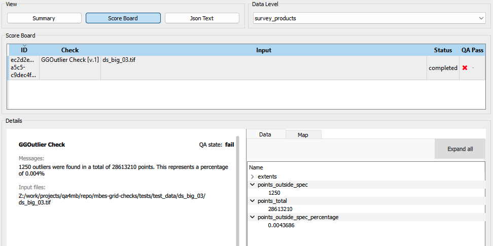
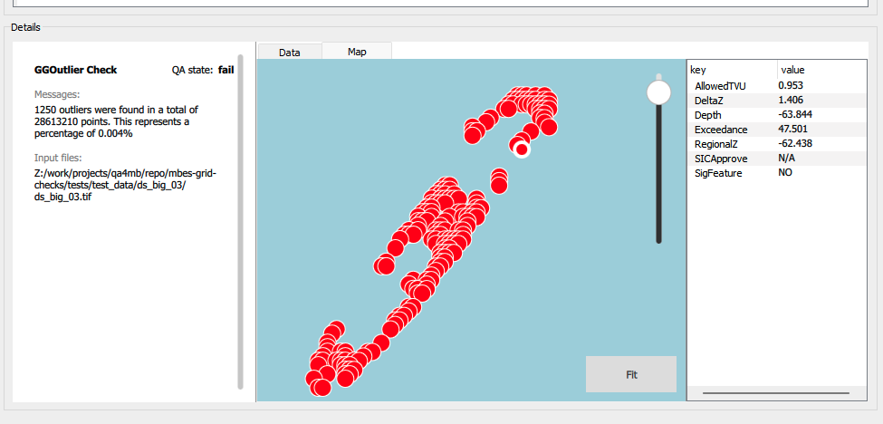

.. _qax-ggoutlier:

GGOutlier
============

.. index::
    single: GGOutlier

GGOutlier is a tool for identifying outliers in bathymetric depth data.
The GGOutlier QAX plugin integrates the GGOutlier command line tool into QAX. Detailled documentation
can be found in the `source code repository <https://github.com/pktrigg/ggoutlier>`_. The following
excerpt was taken from this repository.

  In bathymetry, an outlier typically refers to an isolated or anomalous depth measurement or feature on a seafloor depth map or chart. These outliers can be depths that are significantly different from the surrounding seafloor topography. Outliers might be caused by various factors such as errors in data collection, equipment malfunction, or unique geological features like wrecks, obstructions, seamounts or underwater volcanoes that stand out from the surrounding seabed. The scale of an outlier can be considerable. Identifying and understanding outliers in bathymetric data is important for accurate navigation, scientific research, and ocean exploration. Separating a real feature from noise is a complex issue. The final decision comes down to the skill and experience of the Surveyor In Charge. GGOutlier efficiently analyse and highlight outliers for validation.

Inputs
---------

Input Files
^^^^^^^^^^^^^^
The QAX GGOutlier plugin, and GGOutlier, will operate on GeoTIFFs that meet the requirements
defined for the :doc:`MBES Grid Checks <./user_manual_qax_MBESGC>`. Specifically
GGOutlier requires a single or multiband GeoTIFF that includes depth data.

* For single band files the filename must include the term 'depth', or 'depth' must be used as the band name within the GeoTIFF metadata
* For multiband files the name 'depth' must be used in the metadata for that band within the GeoTIFF

Input Parameters
^^^^^^^^^^^^^^^^^^^

.. _ggoutlier_params:

================================================  ====================================
Parameter                                         Description
================================================  ====================================
Standard                                          Specify the IHO SP44 survey order so we can set the filters to match the required specification.
Near                                              ADVANCED:Specify the MEDIAN filter kernel width for computation of the regional surface so nearest neighbours can be calculated. [Default:5]
Verbose                                           Enable to write LAS files and other supporting files. Note: this takes additional time.
================================================  ====================================

Results
-----------
**The QAX GGOutlier plugin will mark a dataset as failed if GGOutlier identifies a single outlier.**

QAX provides a summary of the output generated by GGOutlier, this can be displayed in the 'Score Board' view
in the QAX results tab as shown below.

Each outlier idenfied can be viewed in the results tab map window. Clicking on these outliers will display
metadata related to these points as generated by GGOutlier.

Output files
^^^^^^^^^^^^^
The 'Export detailed spatial outputs...' option on the QAX run tab must be selected for GGOutlier to generate
output files. These files will be included in a '<inputfilename>/GGOutlier Check' subfolder under the 'Detailed
spatial output folder location'

GGOutlier output files includes:
* shapefile including location of all outliers
* las file including location of all outliers
* PDF summary report
* Other GeoTIFFs generated by GGOutlier during analysis

