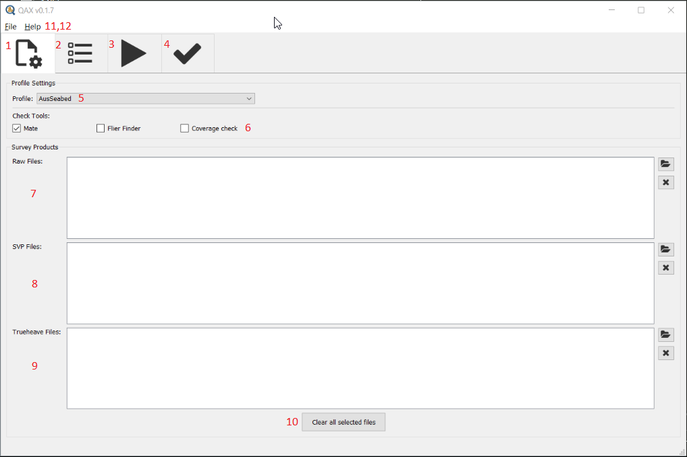

.. _qax-mate:

Mate
============

.. index::
    single: Mate

Inputs
-----------------------------------------
Raw multibeam files can be used as input to the Mate plugin in QAX
File type supported by the current version:

#. Kongsberg (.all)

#. Generic Sensor format (.gsf)

Raw svp files can be used as input to the Mate plugin in QAX
File type supported by the current version:

#. All file extensions are supported

Raw delayed heave files can be used as input to the Mate plugin in QAX
File type supported by the current version:

#. All file extensions are supported

Checks
-----------------------------------------

Kongsberg .all checks
^^^^^^^^^^^^^^^^^^^^^^

Use the scan_ALL library to provide information to the user about the raw data they are collecting

.. autoclass:: hyo2.mate.lib.scan_ALL.ScanALL
|

    .. automethod:: hyo2.mate.lib.scan_ALL.ScanALL.backscatter_availability
    
The datagrams in a .all required for backscatter processing are divided up into critical and non-critical as per the following table
    
============================  ====================================
Critical                       Noncritical
============================  ====================================
A - Attitude                   I - Installation Parameters
P - Position                   R - Runtime Parameters
f - Raw Range and Angle or     n - Network Attitude and Velocity
F - Raw Range and Angle or     G - Surface Sound Speed
N - Raw Range and Angle        U - Sound Velocity
S - Seabed Image or            D - Depth or
Y - Seabed Image               X - Depth
============================  ====================================

The messages within :class:`hyo2.mate.lib.scan.ScanResult` will provide information to help debug

The data within :class:`hyo2.mate.lib.scan.ScanResult` will indicate which datagrams aren't present in the file

    .. automethod:: hyo2.mate.lib.scan_ALL.ScanALL.bathymetry_availability
    
The datagrams in a .all required for bathymetry processing are divided up into critical and non-critical as per the following table
    
============================  ====================================
Critical                       Noncritical
============================  ====================================
A - Attitude                   I - Installation Parameters
P - Position                   R - Runtime Parameters
f - Raw Range and Angle or     n - Network Attitude and Velocity
F - Raw Range and Angle or     G - Surface Sound Speed
N - Raw Range and Angle        U - Sound Velocity
\                              D - Depth or
\                              X - Depth
============================  ====================================

The messages within :class:`hyo2.mate.lib.scan.ScanResult` will provide information to help debug

The data within :class:`hyo2.mate.lib.scan.ScanResult` will indicate which datagrams aren't present in the file

    .. automethod:: hyo2.mate.lib.scan_ALL.ScanALL.date_match
|

    .. automethod:: hyo2.mate.lib.scan_ALL.ScanALL.ellipsoid_height_setup
|

    .. automethod:: hyo2.mate.lib.scan_ALL.ScanALL.filename_changed
|

    .. automethod:: hyo2.mate.lib.scan_ALL.ScanALL.ray_tracing_availability
    
The datagrams in a .all required for recalculating ray tracing are divided up into critical and non-critical as per the following table
    
============================  ====================================
Critical                       Noncritical
============================  ====================================
A - Attitude                   I - Installation Parameters
P - Position                   R - Runtime Parameters
f - Raw Range and Angle or     n - Network Attitude and Velocity
F - Raw Range and Angle or     G - Surface Sound Speed
N - Raw Range and Angle        U - Sound Velocity
============================  ====================================

The messages within :class:`hyo2.mate.lib.scan.ScanResult` will provide information to help debug

The data within :class:`hyo2.mate.lib.scan.ScanResult` will indicate which datagrams aren't present in the file

    .. automethod:: hyo2.mate.lib.scan_ALL.ScanALL.runtime_parameters
|

    .. automethod:: hyo2.mate.lib.scan_ALL.ScanALL.positions
|
    
Generic sensor format .gsf checks
^^^^^^^^^^^^^^^^^^^^^^^^^^^^^^^^^^

Use the scan_gsf library to provide information to the user about the raw data they are collecting

.. autoclass:: hyo2.mate.lib.scan_gsf.ScanGsf
|

    .. automethod:: hyo2.mate.lib.scan_gsf.ScanGsf.backscatter_availability
    .. note::
        Not implemented for the GSF format

    .. automethod:: hyo2.mate.lib.scan_gsf.ScanGsf.bathymetry_availability
|

    .. automethod:: hyo2.mate.lib.scan_gsf.ScanGsf.date_match
|

    .. automethod:: hyo2.mate.lib.scan_gsf.ScanGsf.ellipsoid_height_setup
    .. note::
        Not implemented for the GSF format

    .. automethod:: hyo2.mate.lib.scan_gsf.ScanGsf.filename_changed
    .. note::
        Not implemented for the GSF format

    .. automethod:: hyo2.mate.lib.scan_gsf.ScanGsf.ray_tracing_availability
    .. note::
        Not implemented for the GSF format

    .. automethod:: hyo2.mate.lib.scan_gsf.ScanGsf.runtime_parameters
    .. note::
        Not implemented for the GSF format

    .. automethod:: hyo2.mate.lib.scan_gsf.ScanGsf.positions
|

Outputs
-----------------------------------------

.. autoclass:: hyo2.mate.lib.scan.ScanResult
|

.. autoclass:: hyo2.mate.lib.scan.ScanState

    .. autoattribute:: PASS
    .. autoattribute:: FAIL
    .. autoattribute:: WARNING

Interface
-----------------------------------------
Upon initial opening of the QAX interface two windows will open.  One is a console window that provides 
extra information and assists with debugging, the other is the main graphical user interface (GUI).

.. _console:
.. figure:: _static/console_qax.png
    :width: 1000px
    :align: center
    :alt: console
    :figclass: align-center

    Console window

.. _QAX_Interface:
.. figure:: _static/interface_qax.png
    :width: 1000px
    :align: center
    :alt: initial interface
    :figclass: align-center

    Initial QAX GUI interface
    
The initial tab that is opened when QAX is started in the input tab.  A breakdown of the tab is explained
below

.. _QAX_input_breakdown:

    QAX GUI input breakdown
    
#. QAX tab - The QAX tab is the initial tab where all the inputs are entered, the suite of checks you want to run are selected or a profile of designated check is selected
#. Plugins tab - The Plugins tab is where all additional parameters for checks are entered
#. Run Checks tab - The Run Checks tab is where you can control the runnning of checks on your inputs
#. View Check results tab - View the results of the checks you have run
#. Profile selection - Select a profile that automatically selects checks to run
    .. note::
        Not implemented in the current version of QAX
#. Check selection - Check boxes to select the checks you want to run
    .. note::
        Only the MATE plugin is implemented in the current version of QAX
#. Add raw multibeam files - Add raw multibeam files to run MATE checks on
    .. note::
        Only Kongsberg .all and Generic Sensor Format .gsf are implemented in the current version of MATE
#. Add raw svp files - Add raw svp files
#. Add delayed heave files - Add delayed heave files
#. Clear all files button - Clears all files from the selection boxes
#. File Menu - File menu currently enables the saving and opening of QAJson files after checks have been run
#. Help Menu - Enables access to the QAX documentation

.. _QAX_plugins_breakdown:
.. figure:: _static/plugins_breakdown_qax.png
    :width: 1000px
    :align: center
    :alt: plugins breakdown
    :figclass: align-center

    QAX GUI plugins breakdown
    
.. note::
    This tab in the QAX is currently for future use
    
.. _QAX_run_checks_breakdown:
.. figure:: _static/runchecks_breakdown_qax.png
    :width: 1000px
    :align: center
    :alt: run checks breakdown
    :figclass: align-center

    QAX GUI run checks breakdown

#. Run button - Run the checks
#. Stop button - Stop the checks
#. Progress - Progress bar

.. _QAX_view_results_breakdown:
.. figure:: _static/checkresults_breakdown_qax.png
    :width: 1000px
    :align: center
    :alt: view checks breakdown
    :figclass: align-center

    QAX GUI view results breakdown
    
#. Data level - Data level drop box enables changing from displaying check results for raw data or data products
    .. note::
        Only raw data results are implemented in the current version of MATE
#. Results view - Enables changing the granularity of the checks
    - Summary gives a summary of the overall check results, i.e. a count of the lines pass, fail or warning
    - Scoreboard enables viewing of results per line
    - json text is a raw printout of the QAJson created after running the checks
#. View - The part of the window that is changed by the above dropdown
#. Details - Details is a subsection of the view part of the window.  I will change depening on what you select within the view pane
    - As an example selecting the summary view --> summary item runtime parameters will display a geographic map with the location of where runtime parameters where changed
    - If you then select one of those geographic locations a table of runtime parameters will be populated
    - If you then select a different geographic location the table will update but highlight any runtime parameters that change between the points
    - Essentially the details view is the variable part of the output and will change depending on what check or summary of checks you choose
    - You can view geographic data, summary information or tabulated information to inform you of what the check results details where