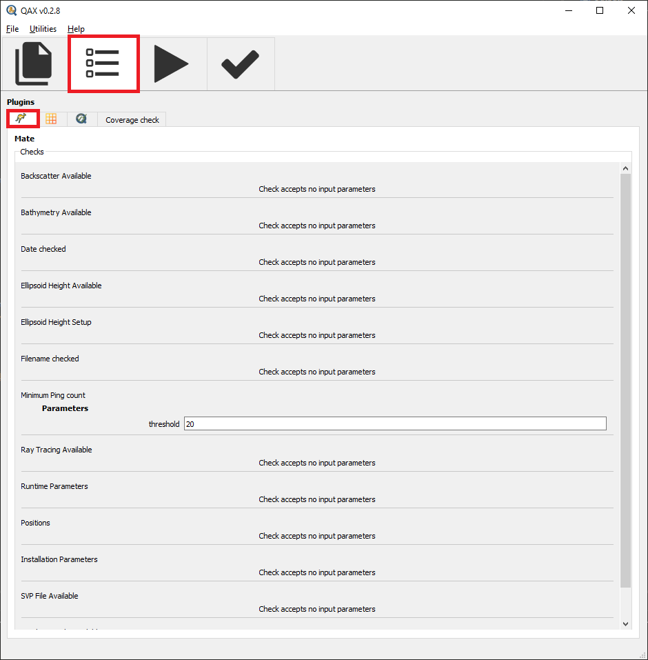
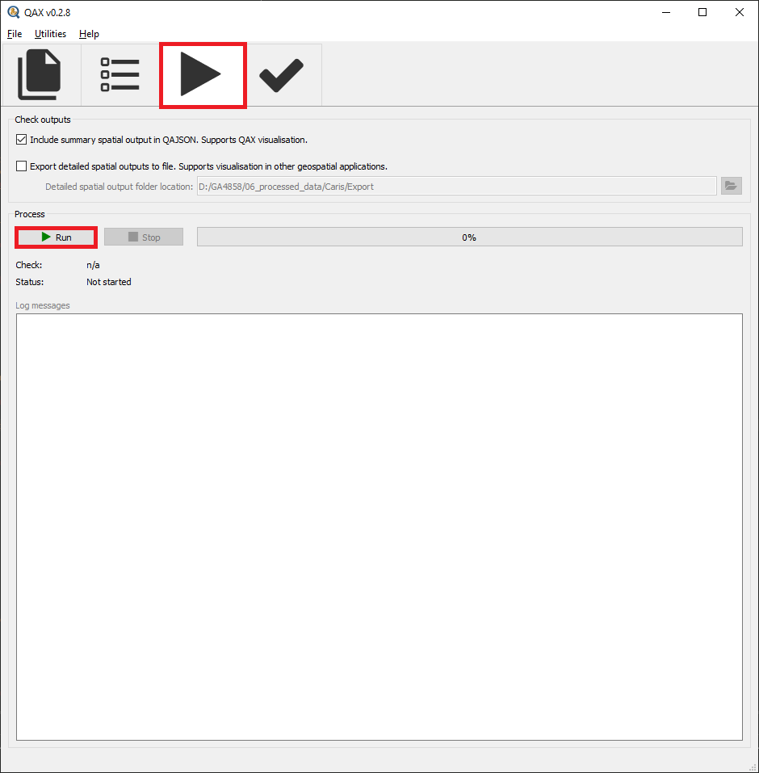
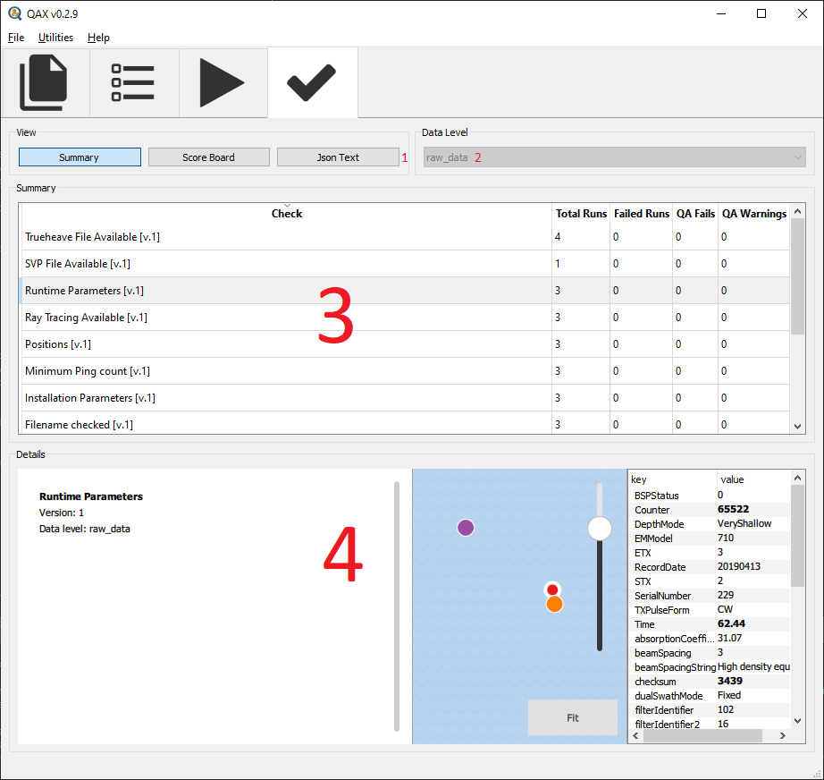

.. _qax-mate:

Mate
============

.. index::
    single: Mate

Inputs
-----------------------------------------
Raw multibeam files can be used as input to the Mate plugin in QAX
File type supported by the current version:

#. Kongsberg (.all)

#. Kongsberg (.kmall)

#. Generic Sensor format (.gsf)

Raw svp files can be used as input to the Mate plugin in QAX
File type supported by the current version:

#. All file extensions are supported

Raw delayed heave files can be used as input to the Mate plugin in QAX
File type supported by the current version:

#. All file extensions are supported

Checks
-----------------------------------------

Kongsberg .all checks
^^^^^^^^^^^^^^^^^^^^^^

Use the scan_ALL library to provide information to the user about the raw data they are collecting

.. autoclass:: hyo2.mate.lib.scan_ALL.ScanALL
|

    .. automethod:: hyo2.mate.lib.scan_ALL.ScanALL.backscatter_availability
    
The datagrams in a .all required for backscatter processing are divided up into critical and non-critical as per the following table
    
============================  ====================================
Critical                       Noncritical
============================  ====================================
A - Attitude                   I - Installation Parameters
P - Position                   R - Runtime Parameters
f - Raw Range and Angle or     n - Network Attitude and Velocity
F - Raw Range and Angle or     G - Surface Sound Speed
N - Raw Range and Angle        U - Sound Velocity
S - Seabed Image or            D - Depth or
Y - Seabed Image               X - Depth
============================  ====================================

The messages within :class:`hyo2.mate.lib.scan.ScanResult` will provide information to help debug

The data within :class:`hyo2.mate.lib.scan.ScanResult` will indicate which datagrams aren't present in the file

    .. automethod:: hyo2.mate.lib.scan_ALL.ScanALL.bathymetry_availability
    
The datagrams in a .all required for bathymetry processing are divided up into critical and non-critical as per the following table
    
============================  ====================================
Critical                       Noncritical
============================  ====================================
A - Attitude                   I - Installation Parameters
P - Position                   R - Runtime Parameters
f - Raw Range and Angle or     n - Network Attitude and Velocity
F - Raw Range and Angle or     G - Surface Sound Speed
N - Raw Range and Angle        U - Sound Velocity
\                              D - Depth or
\                              X - Depth
============================  ====================================

The messages within :class:`hyo2.mate.lib.scan.ScanResult` will provide information to help debug

The data within :class:`hyo2.mate.lib.scan.ScanResult` will indicate which datagrams aren't present in the file

    .. automethod:: hyo2.mate.lib.scan_ALL.ScanALL.date_match
|

    .. automethod:: hyo2.mate.lib.scan_ALL.ScanALL.ellipsoid_height_setup
|

    .. automethod:: hyo2.mate.lib.scan_ALL.ScanALL.filename_changed
|

    .. automethod:: hyo2.mate.lib.scan_ALL.ScanALL.ray_tracing_availability
    
The datagrams in a .all required for recalculating ray tracing are divided up into critical and non-critical as per the following table
    
============================  ====================================
Critical                       Noncritical
============================  ====================================
A - Attitude                   I - Installation Parameters
P - Position                   R - Runtime Parameters
f - Raw Range and Angle or     n - Network Attitude and Velocity
F - Raw Range and Angle or     G - Surface Sound Speed
N - Raw Range and Angle        U - Sound Velocity
============================  ====================================

The messages within :class:`hyo2.mate.lib.scan.ScanResult` will provide information to help debug

The data within :class:`hyo2.mate.lib.scan.ScanResult` will indicate which datagrams aren't present in the file

    .. automethod:: hyo2.mate.lib.scan_ALL.ScanALL.runtime_parameters
|

    .. automethod:: hyo2.mate.lib.scan_ALL.ScanALL.positions
|
    
Kongsberg .kmall checks
^^^^^^^^^^^^^^^^^^^^^^^^^^^

Use the scan_KMALL library to provide information to the user about the raw data they are collecting

.. autoclass:: hyo2.mate.lib.scan_KMALL.ScanKMALL
|

    .. automethod:: hyo2.mate.lib.scan_KMALL.ScanKMALL.backscatter_availability
    
The datagrams in a .kmall required for backscatter processing are divided up into critical and non-critical as per the following table
    
============================  ====================================
Critical                       Noncritical
============================  ====================================
SKM - Attitude                 IIP - Installation Parameters
SPO - Position                 IOP - Runtime Parameters
MRZ - Seabed Reflectivity      SVT - Surface Sound Speed
\                              SVP - Sound Velocity
============================  ====================================

The messages within :class:`hyo2.mate.lib.scan.ScanResult` will provide information to help debug

The data within :class:`hyo2.mate.lib.scan.ScanResult` will indicate which datagrams aren't present in the file

    .. automethod:: hyo2.mate.lib.scan_KMALL.ScanKMALL.bathymetry_availability
    
The datagrams in a .kmall required for bathymetry processing are divided up into critical and non-critical as per the following table
    
============================  ====================================
Critical                       Noncritical
============================  ====================================
SKM - Attitude                 IIP - Installation Parameters
SPO - Position                 IOP - Runtime Parameters
MRZ - XYZ                      SVT - Surface Sound Speed
\                              SVP - Sound Velocity
============================  ====================================

The messages within :class:`hyo2.mate.lib.scan.ScanResult` will provide information to help debug

The data within :class:`hyo2.mate.lib.scan.ScanResult` will indicate which datagrams aren't present in the file

    .. automethod:: hyo2.mate.lib.scan_KMALL.ScanKMALL.date_match
|

    .. automethod:: hyo2.mate.lib.scan_KMALL.ScanKMALL.ellipsoid_height_setup
|

    .. automethod:: hyo2.mate.lib.scan_KMALL.ScanKMALL.filename_changed
|

    .. automethod:: hyo2.mate.lib.scan_KMALL.ScanKMALL.ray_tracing_availability
    
The datagrams in a .kmall required for recalculating ray tracing are divided up into critical and non-critical as per the following table
    
============================  ====================================
Critical                       Noncritical
============================  ====================================
SKM - Attitude                 IIP - Installation Parameters
SPO - Position                 IOP - Runtime Parameters
MRZ - Raw range and angle      SVT - Surface Sound Speed
\                              SVP - Sound Velocity
============================  ====================================

The messages within :class:`hyo2.mate.lib.scan.ScanResult` will provide information to help debug

The data within :class:`hyo2.mate.lib.scan.ScanResult` will indicate which datagrams aren't present in the file

    .. automethod:: hyo2.mate.lib.scan_KMALL.ScanKMALL.runtime_parameters
|

    .. automethod:: hyo2.mate.lib.scan_KMALL.ScanKMALL.positions
|
    

Generic sensor format .gsf checks
^^^^^^^^^^^^^^^^^^^^^^^^^^^^^^^^^^

Use the scan_gsf library to provide information to the user about the raw data they are collecting

.. autoclass:: hyo2.mate.lib.scan_gsf.ScanGsf
|

    .. automethod:: hyo2.mate.lib.scan_gsf.ScanGsf.backscatter_availability
    .. note::
        Not implemented for the GSF format

    .. automethod:: hyo2.mate.lib.scan_gsf.ScanGsf.bathymetry_availability
|

    .. automethod:: hyo2.mate.lib.scan_gsf.ScanGsf.date_match
|

    .. automethod:: hyo2.mate.lib.scan_gsf.ScanGsf.ellipsoid_height_setup
    .. note::
        Not implemented for the GSF format

    .. automethod:: hyo2.mate.lib.scan_gsf.ScanGsf.filename_changed
    .. note::
        Not implemented for the GSF format

    .. automethod:: hyo2.mate.lib.scan_gsf.ScanGsf.ray_tracing_availability
    .. note::
        Not implemented for the GSF format

    .. automethod:: hyo2.mate.lib.scan_gsf.ScanGsf.runtime_parameters
    .. note::
        Not implemented for the GSF format

    .. automethod:: hyo2.mate.lib.scan_gsf.ScanGsf.positions
|

Outputs
-----------------------------------------

.. autoclass:: hyo2.mate.lib.scan.ScanResult
|

.. autoclass:: hyo2.mate.lib.scan.ScanState

    .. autoattribute:: PASS
    .. autoattribute:: FAIL
    .. autoattribute:: WARNING

Interface
-----------------------------------------
Upon initial opening of the QAX interface two windows will open.  One is a console window that provides 
extra information and assists with debugging, the other is the main graphical user interface (GUI).

.. _console:
.. figure:: _static/console_qax.png
    :width: 1000px
    :align: center
    :alt: console
    :figclass: align-center

    Console window

.. _QAX_Interface:
.. figure:: _static/interface_qax.png
    :width: 1000px
    :align: center
    :alt: initial interface
    :figclass: align-center

    Initial QAX GUI interface
    
The initial tab that is opened when QAX is started in the input tab.  A breakdown of the tab is explained
below

.. _QAX_input_breakdown:
.. figure:: _static/mate_qax.png
    :width: 1000px
    :align: center
    :alt: input breakdown
    :figclass: align-center

    QAX mate GUI input breakdown
    
When the mate plugin is selected the the QAX interface will change to show the inputs
that work with the plugin.  As shown in the screenshot it is raw multibeam files, sound
velocity profile files and trueheave files.

#. Check tools - Used to select the plugin you want to run in this case Mate
#. Folder icon - Used to select the raw files you want to check.  Will open independant popup for selection
#. Remove file - you can remove files and of the x buttons not highlighted or the clear all files button
    .. note::
        Profile selection is not implemented in the current version of QAX
        
After raw files have been added into the QAX interface navigate to the plugins tab

.. _QAX_plugins_breakdown:

    QAX mate parameters breakdown
    
| There is currently limited parameters able to be set for the mate plugin as most of the
  functionality exists in reading raw files and collecting metadata and information to be
  logged into the QAjson and output gui

| After parameters are set navigate to the run checks tab
    
.. _QAX_run_checks_breakdown:

    QAX GUI run checks breakdown

To run the QAX checks on your raw data files press the play button.  The check that is being
run will be shown on the display as well as the status.  Logging messages will provide
further information and time taken to run the checks.

    .. note::
        The checkbox to Export detailed spatial outputs to file is currently not implemented with the mate plugin and only works with the mbesgc plugin

.. _QAX_view_results_breakdown:

    QAX GUI view results breakdown
    
#. View Selection - Choose between a summary of all data, score board view to look at the individual line level or qajson output
    - Summary gives a summary of the overall check results, i.e. a count of the lines pass, fail or warning
    - Scoreboard enables viewing of results per line
    - json text is a raw printout of the QAJson created after running the checks
#. Data Level - Automatically updates on summary view but is selectable on scoreboard view.  Options are:
    - raw_data
    - survey_products
#. Check Selection - Choose the check you want to view in the details view
#. Details - Details is a subsection of the view part of the window.  It will change depening on what you select within the view pane
    - As an example selecting the summary view --> summary item runtime parameters will display a geographic map with the location of where runtime parameters where changed
    - If you then select one of those geographic locations a table of runtime parameters will be populated
    - If you then select a different geographic location the table will update but highlight any runtime parameters that change between the points
    - Essentially the details view is the variable part of the output and will change depending on what check or summary of checks you choose
    - You can view geographic data, summary information or tabulated information to inform you of what the check results details where