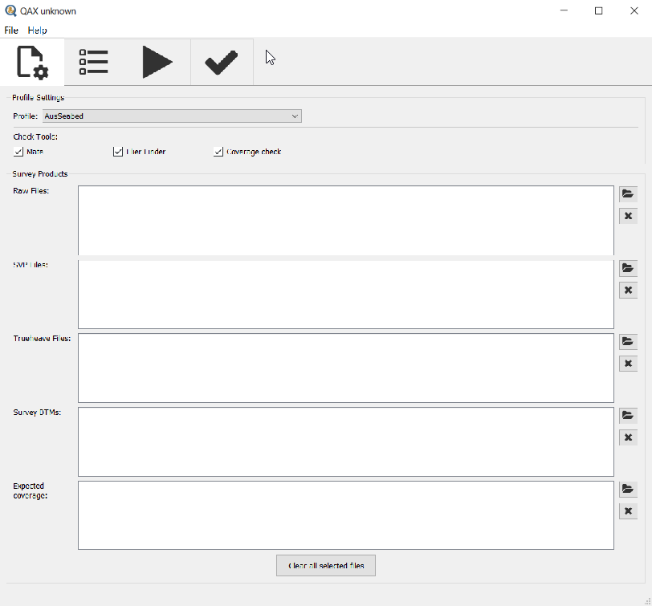
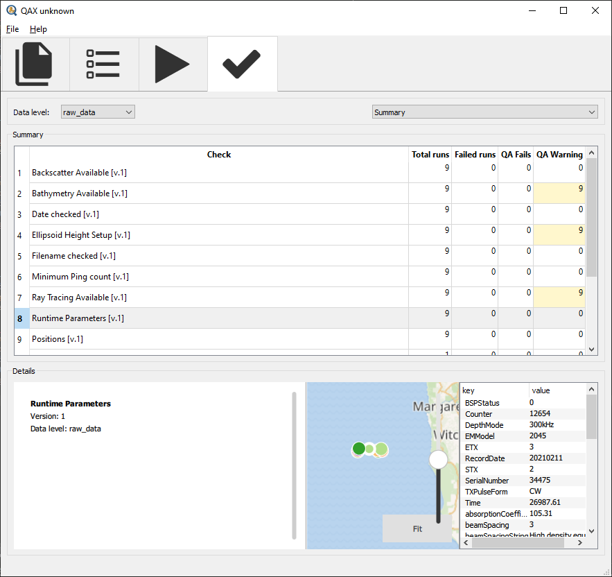
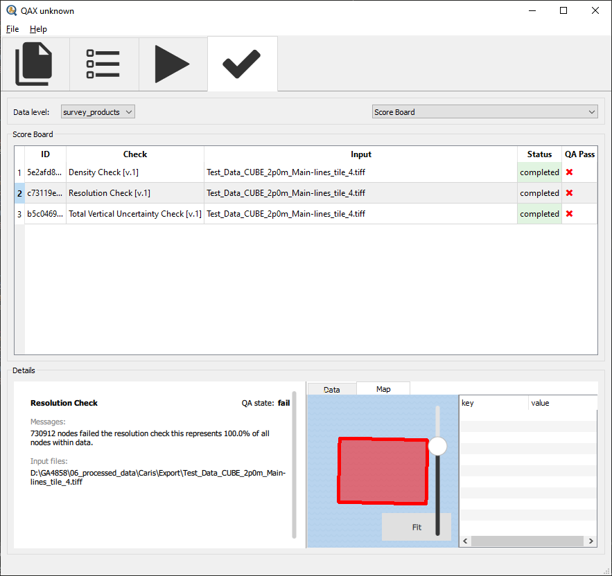

Overview
=========

.. index::
    single: QA Checks

QAX
-----------------------------------------
QAX is an overarching framework and (graphical user interface) that is designed to enable the creation of checks on multibeam
related datasets that are "plugged in" to the framework and GUI.  It is designed to be an enabler to community designed and
created checks giving them a home structure for their inputs, computations and meaningful outputs.

.. _QAX_inputs:

    Raw file input box
    
MATE
-----------------------------------------
MATE is a plugin for QAX that contains the handling, smarts and output requirements for raw multibeam data checks.
This plugin is designed to give the user feedback on the makeup of raw data files and identify potential issues
with system setup prior to collecting large amounts of data.

.. _QAX_inputs:

    Raw file output summary
    
MBESGC
-----------------------------------------
MBESGC is a plugin for QAX that contains the handling, smarts and output requirements for processed multibeam data checks
(i.e. gridded data products).  This plugin is designed check gridded products against particular standards e.g.
IHO Order 1a

.. _QAX_inputs:

    Processed output scoreboard