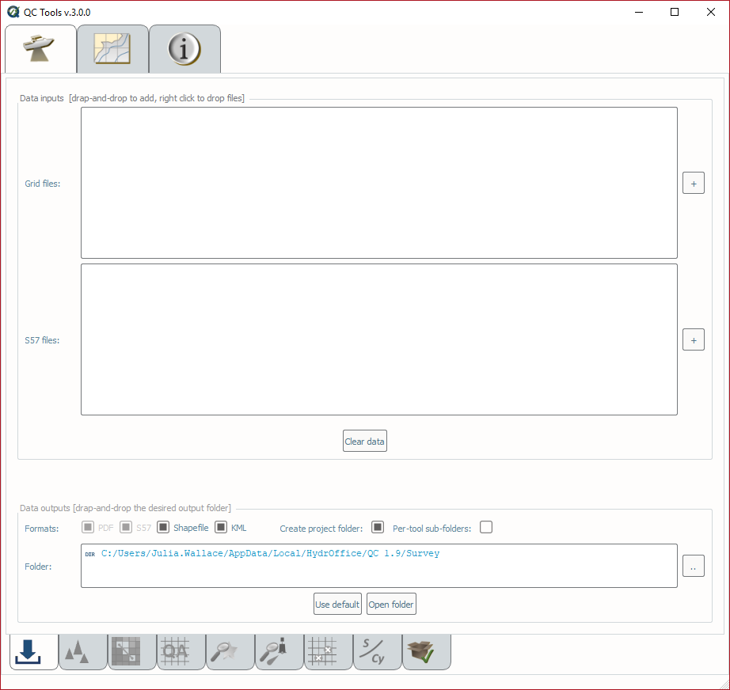
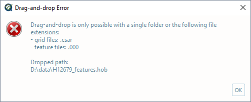
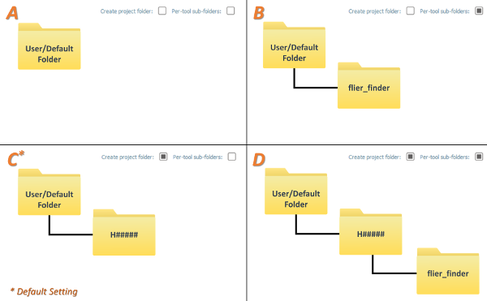

.. _survey-data-inputs:

Data inputs
-----------

Receive bathymetric grids and feature files.

.. index::
    single: survey review

* Select the **Survey Validation** tab on the QC Tools interface.

.. index::
    single: drag-and-drop
    single: data; browsing
    single: bag
    single: csar
    single: S57

In **Data inputs:**

* Drag-and-drop any number of grids and/or features files, anywhere onto the interface. The **\"+\"** browse button may also be used.

* The directory and filename of accepted grid and feature files will populate in the respective locations of Data inputs.

.. index::
    single: detect fliers
    single: scan features
    single: VALSOU checks
    single: SBDARE export

* With the addition of a grid and features, the **Detect fliers**, **Detect holidays**, **Grid QA**, **Scan designated**, **Scan features**,
  **VALSOU checks**, and **SBDARE export** tabs on the bottom of the interface are now available (:numref:`fig_survey_inputs`).

.. _fig_survey_inputs:

    Data inputs and outputs for the *Survey* tab.

* Note that any unaccepted file types will be rejected with a message to inform the user (:numref:`fig_survey_inputs_error`).

.. _fig_survey_inputs_error:

    The error message for unsupported formats.

.. index::
    single: data; clear

* The **Clear data** button may be used to remove all data inputs.

.. index::
    single: data; folder

In **Data outputs:**

* The output **Formats** may be customized. The user has the option to suppress **Shapefile** and **KML** output.

* Output files location is controlled by the **Create project folder** and **Per-tool sub-folder** flags. The four available combinations are:

  * No flags set (see :numref:`survey_folder_structure`, pane A). The outputs are stored directly under the default or user-defined location.
  * Only the **Per-tool sub-folders** flag set (see :numref:`survey_folder_structure`, pane B). The outputs are stored in a tool-specific sub-folder (in the default or user defined-location).
  * Only the **Create project folder** flag set (see :numref:`survey_folder_structure`, pane C). The outputs are stored in a survey folder (in the default or user defined-location). *This is the default setting.*
  * Both flags set (see :numref:`survey_folder_structure`, pane D). The outputs are stored in tool-specific sub-folders in a survey folder (in the default or user defined-location).

.. _survey_folder_structure:

    The resulting folder structure based on the four available combinations of output flags.

* The default output **Folder** location is listed; however, this may be modified via drag-and-drop (or browse to) a user-specified output folder. To return to the default output folder location, click **Use default**. 

* The ensuing functions will open the output folder automatically upon execution;  however, if needed, the specified output folder may be accessed by clicking the **Open folder** button.
