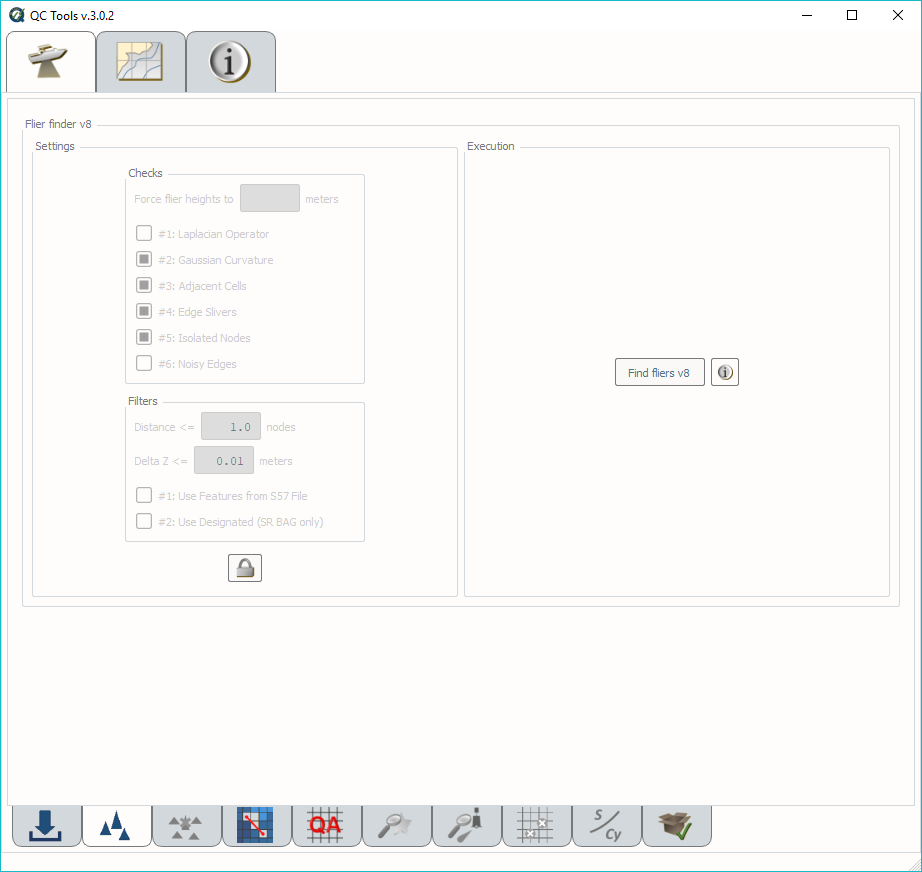
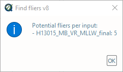
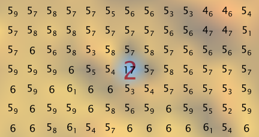
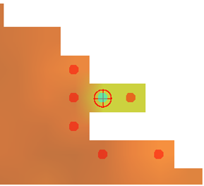
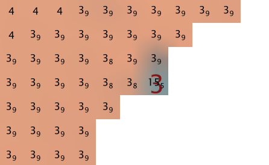
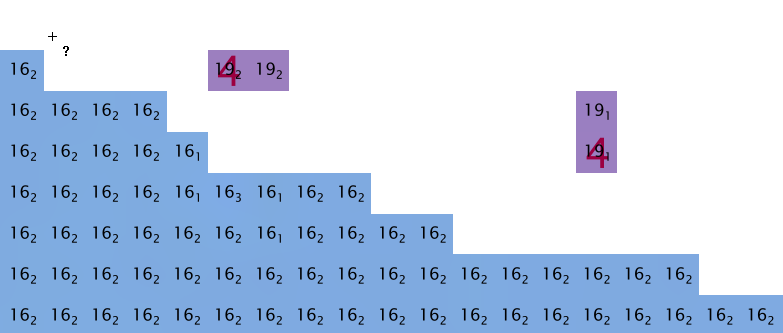
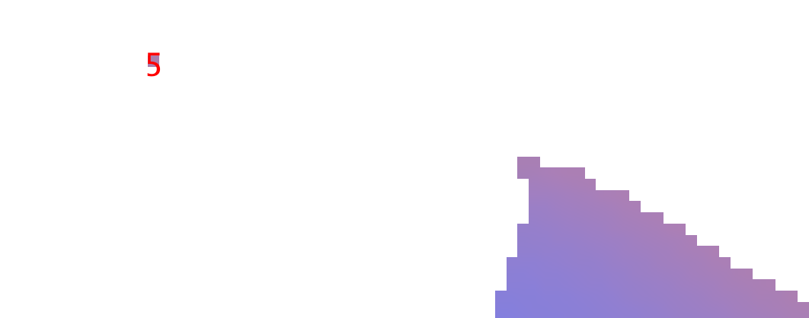
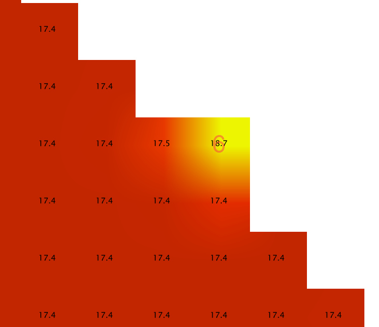

.. _survey-detect-fliers:

Detect fliers
-------------

.. index::
    single: fliers

How To Use?
^^^^^^^^^^^

Scan grids for anomalous grid data "fliers".

* Select the **Detect fliers** tab (:numref:`fig_detect_fliers`) on the bottom of the QC Tools interface.

.. index::
    single: fliers; height

* For **Flier finder v8**, first consider **Settings:**

  * The **Flier height** will be determined automatically by the program and does not need to be set, but the user may choose to do so in order to run a specific **Flier height**.
  * The automatic determination of **Flier height** is performed per tile, and is based on the `median`_ depth (characteristic depth), the `MAD`_ (variability in range), and the standard deviation of the `gaussian curvature`_ (roughness).
  * The selected **Checks** are enabled by default. You can enable or disable them in order to run custom analysis (see the "How Does It Work?" section below).

* To change the **Settings** for **Flier finder v8**:

  * Click the **Unlock** button, and click **OK** to the dialogue.
  * If desired, enter a desired Flier search height in meters in the **Force flier heights** box.

    * A single height may be entered to apply to all loaded grids, or multiple heights may be entered (separated by comma) to apply to each grid loaded.
    * These values, if entered, will override any **Estimated heights** determined by the program.

  * Enable or disable the specific **Checks** to run.

  * If desired, modify the filtering horizontal and vertical distances from the closest point feature or designated sounding.

  * Enable or disable the specific **Filters** to run.

.. _fig_detect_fliers:

    The **Flier finder fliers** tab.

.. index::
    single: find fliers

* In **Execution** for **Flier finder v8**:

  * Click **Find fliers v8**. After executing, the output window opens automatically (:numref:`fig_detect_fliers_output`), and the results are shown:

.. _fig_detect_fliers_output:

    The output message at the end of **Flier finder v8** execution.

* An output window will open in File Explorer. From the output window, drag-and-drop the desired output file into the processing software to guide the review. Each candidate flier is labeled using the identifier of the algorithm that detected it (e.g., "2" for Gaussian Curvature).

* The output file names adopt the following convention:

  * [grid filename].FFv8.chk[identifier of each selected algorithm].flt[identifier of each selected filter]

|

-----------------------------------------------------------

|

How Does It Work?
^^^^^^^^^^^^^^^^^

**Flier finder v8:**

**Estimate height:**

First, a base height from the median depth of the grid is assigned:

+----------------+-------------+
| Depth Interval | Base height |
+================+=============+
| if < 20        | 1.0         |
+----------------+-------------+
| if < 40        | 2.0         |
+----------------+-------------+
| if < 80        | 4.0         |
+----------------+-------------+
| if < 160       | 6.0         |
+----------------+-------------+
| if >= 160      | 8.0         |
+----------------+-------------+

Then, the base height is incrementally increased by the level of depth variability and roughness of the grid:

* Depth variability is estimated by proxy using the Normalized Median of Absolute Deviation (NMAD) of the grid, which is derived by dividing the absolute difference of depth mean and depth median by depth standard deviation.

  * The lower the NMAD, the more depth variability we estimate.
  * An increase in the Base height of the flier search height estimation is warranted if NMAD is less than 0.20 (1 increase) or less than 0.10 (2 increases).

* Roughness is estimated by the standard deviation of the Gaussian curvature (STD_CURV).

  * The Gaussian curvature is a measure of concavity at each node, whether concave up (shoal) or concave down (deep).
  * The higher the STD_CURV, the rougher the surface.
  * An increase in the Base height of the flier search height estimation is warrented if STD_CURV is greater than 0.01 (1 increase) or greater than 0.10 (2 increases).

Increases are +2.0 meters, unless the Base height is 1.0 meter, then the increase is +1.0 meter. In this manner, Estimated flier heights are always on the interval scale of 1 (minimum), 2, 4, 6, 8, 10, 12, 14, 16 (maximum).

For example:

* If a surface has depth median = 12 m, NMAD = 0.15, and STD_CURV = 0.005, then the Estimated height = 2.0 m.
* If a surface has depth median = 75 m, NMAD = .04, and STD_CURV = 0.08, then the Estimated height = 10.0 m.

----------------------------------------------------------------

**Checks:**

**Laplacian Operator**

The Laplacian Operator is a measure of curvature at each node. It is equivalent to summing the depth gradients of the four nodes adjacent (north, south, east, and west) to each node. If the absolute value of the Laplacian Operator is greater than four times the flier search height, the node will be flagged.

In the example below, a 3 m flier search height would register 1 flag, while a 2 m flier search height would register 4 flags, and a 1m search height would register 7 flags.

+---+---+---+---+---+---+---+---+---+
|  Depth Layer  |   | Laplace       |
+===+===+===+===+===+===+===+===+===+
| 9 | 9 | 9 | 9 |   | 0 | 1 | 0 | 3 |
+---+---+---+---+---+---+---+---+---+
| 9 | 8 | 9 | 6 |   | 1 | 4 | 10| 9 |
+---+---+---+---+---+---+---+---+---+
| 9 | 9 | 3 | 9 |   | 0 | 7 | 24| 9 |
+---+---+---+---+---+---+---+---+---+
| 9 | 9 | 9 | 9 |   | 0 | 0 | 6 | 0 |
+---+---+---+---+---+---+---+---+---+

The algorithm is effective, but may be prone to excessive flags, as demonstrated in the above example. Testing showed that it generally did not reveal fliers not already revealed by the other algorithms. For these reasons, it is disabled by default, but is recommended as an additional check in those situations when the other algorithms return very few or no flags.

The example in :numref:`la_place_ex` shows grid nodes (depths in meters) recommended for further examination by the Laplacian Operator (indicated by 1s) and a 6m estimated search height.

.. _la_place_ex:
.. Figure:: _static/laplace_ex.png
    :align: center
    :alt: logo

    Laplacian Operator.

----------------------------------------------------------------

**Gaussian Curvature**

The Gaussian Curvature is a measure of concavity at each node. The gradients are taken in the x and y directions to establish gx and gy, and repeated on each gradient again in the x and y direction to establish gxx, gxy, gyx, and gyy (note that gxy = gyx). The gaussian curvature at each node is then determined by:

(gxx *  gyy - (gxy * gyx)) / (1 + (gx^2) + (gy^2))^2

Note that this algorithm is dependent on the standard deviation of the tile's gaussian curvature.

In the example below, a single flier is found (regardless of flier height).

+-----+-----+-----+-----+-----+------+------+------+------+
|       Depth Layer     |     |     Gaussian Curvature    |
+=====+=====+=====+=====+=====+======+======+======+======+
|  9  |  9  |  9  |  9  |     |  -1  |   0  |  -1  | -.09 |
+-----+-----+-----+-----+-----+------+------+------+------+
|  9  |  8  |  9  |  6  |     |   0  | -2.3 |   0  | -.14 |
+-----+-----+-----+-----+-----+------+------+------+------+
|  9  |  9  |  3  |  9  |     | -2.5 |   0  |  20  |   0  |
+-----+-----+-----+-----+-----+------+------+------+------+
|  9  |  9  |  9  |  9  |     |   0  |  -9  |   0  |  -36 |
+-----+-----+-----+-----+-----+------+------+------+------+

Testing showed that the algorithm on occasion offered unique value by flagging a flier not captured by other algorithms, while also it is not prone to excessive flags. For these reasons this algorithm is enabled by default.

The example in :numref:`gauss_ex` shows grid nodes (depths in meters) and a deep flier found by the Gaussian Curvature (indicated by the red 2).

.. _gauss_ex:

    Gaussian Curvature.

----------------------------------------------------------------

**Adjacent Cells**

This algorithm examines the nodes that are adjacent to a single node. There are a maximum of 8 adjacent nodes (N,NW,W,SW,S,SE,E,NE), but there could be less than 8 if the node resides on a grid edge.

The algorithm crawls across empty cells (2 nodes diagonally, and 3 nodes in the cardinal directions) in order to establish neighbors. For example, the image below shows that 6 neighbors were found for the flagged node; previous versions of Flier Finder would only have identified 4 (:numref:`crawl`).

.. _crawl:

    Crawling example.

The depth is differenced with each adjacent cell identified, and the number of times the difference is greater in magnitude than the flier search height is tallied. If the ratio of this tally to the number of adjacent cells available is 0.8 or greater, then the node is flagged. [1]_

In the example below, a 3 m flier search height would register 2 flags, while a 2m search height would also register 2 flags, and a 1m search height would register 3 flags.

+---+---+---+---+---+----+----+----+----+
|  Depth Layer  |   | Adjacent Cells(3m)|
+===+===+===+===+===+====+====+====+====+
| 9 | 9 | 9 | 9 |   |  0 |  0 | .2 | .33|
+---+---+---+---+---+----+----+----+----+
| 9 | 8 | 9 | 6 |   |  0 | .13| .25|  1 |
+---+---+---+---+---+----+----+----+----+
| 9 | 9 | 3 | 9 |   |  0 |  0 |  1 | .4 |
+---+---+---+---+---+----+----+----+----+
| 9 | 9 | 9 | 9 |   |  0 | .2 | .2 | .33|
+---+---+---+---+---+----+----+----+----+

Testing showed that the Adjacent Cells algorithm offers unique value by flagging fliers not captured by the other algorithms (especially those residing on grid edges), and is not as prone to excessive flagging as the Laplacian Operator. For these reasons, it is enabled by default.

The example in :numref:`adj_ex` shows grid nodes (depths in meters) and the type of flier that Adjacent Cells (indicated by the red 3) identifies with particular effectiveness, in this case with a 4m search height.

.. _adj_ex:

    Adjacent Cells.

.. rubric:: Footnotes

.. [1] In the case that node has only 4 neighbors, and 3 of these have a difference greater than the search height, the ratio of 0.75 will trigger a flag on the node. This exception has been made because it has been observed so frequently during testing.

----------------------------------------------------------------

**Edge Slivers**

The Edge Slivers algorithm identifies small groups of connected nodes (3 nodes or less) that are detached (but within 5 nodes) from the grid. If the depth difference between the nearest detached node and the valid connection to the grid is greater than half the flier search height, a flag is registered.

Testing showed that the algorithm offers unique value by identifying the quite common fliers that result in areas of sparse data density. For this reason, it is enabled by default.

The example in :numref:`edge_ex` shows grid nodes (depths in meters) and the type of detached nodes that Edge Slivers flags, in this case with a 4m search height.

.. _edge_ex:

    Edge Slivers.

----------------------------------------------------------------

**Isolated Nodes**

The Isolated Nodes algorithm identifies small groups of connected nodes (3 nodes or less) that are detached (but outside of 5 nodes) of the grid. Effectively it is identifying the remaining isolated nodes not caught by Edge Slivers, however, it is independent of flier search height, meaning that all small groups of isolated nodes will be flagged.

Testing shows that the algorithm offers unique value by identifying nodes far detached from the grid that the reviewer may wish to exclude. Because it is identifying any detached nodes and not considering their associated depth, it is largely considered a separate tool to be used on an "as-needed" basis. Therefore, it is not enabled by default.

The example in :numref:`iso_ex`  shows a grid node far detached from the main grid, found by Isolated Nodes (indicated by a red 5).

.. _iso_ex:

    Isolated Nodes.

----------------------------------------------------------------

**Noisy Edges**

The Noisy Edges is tailored to identify fliers along noisy swath edges.

The algorithm crawls across empty cells (2 nodes diagonally, and 3 nodes in the cardinal directions) in order to establish the *edge nodes*.
In the specific, an edge node is identified when 6 or less adjacent valid neighbors are present in the surrounding 8 directions (N, NW, W, SW, S, SE, E, and NE).

Once that an edge node is identified, the least depth and the maximum difference with its neighbors are calculated.

The least depth is used to calculate to local Total Vertical Uncertainty (TVU), and then a flagging threshold is set to 90% of the resulting TVU. The TVU is calculated per NOAA specifications:

.. math::

    TVU = \sqrt{A^2 + (B * Depth)^2}

where :math:`A = 0.5, B = 0.013` for Order 1 (depths less than 100 m), and :math:`A = 1.0, B = 0.023` for Order 2 (depths greater than 100 m).

.. note::
    Since the TVU is based on the local least depth, the algorithm automatically adapts the threshold calculation to the proper Order (1 or 2). For example if the edge node in question is 102m and its neighbors are 99m, the TVU will be calculated at Order 1 specifications.

Finally, an edge node is flagged when the maximum depth difference with its neighbors is greater than the flagging threshold.

:numref:`noisy_ex` shows an example of a flagged 18.7m edge node. Since the shallowest node in the neighborhood is 17.4m, the flagging threshold developed from 90% of the TVU was 0.490m. The maximum difference between the node and its neighbors is 1.3m, therefore the edge node was flagged.

.. _noisy_ex:

    Noisy edges.

----------------------------------------------------------------

**Which Flier Finder Algorithm Should I Use?**

**For basic use:**

* For standardized operation of this tool, the automatic estimated search height and the following checks are recommended:

  * Gaussian Curvature
  * Adjacent Cells
  * Edge Slivers

**For advanced use:**

* If the default options generate too few flags, and/or it is desired to perform a custom search, you may force a smaller flier height, and/or utilize the "Laplace Operator" algorithm.
* The "Isolated Nodes" algorithm is used to find nodes detached from the grid and is an independent check to be used on an as-needed basis.
* The "Noisy Edge" algorithm is used to identify fliers along survey edges. It is recommended for use with surveys that are utilizing corresponding side scan coverage.

A summary of the checks is shown in the table below, and also see the "How Does It Work?" section to understand how each check works.

+--------------------------+-------------+-------------+-------------+-------------+------------+------------+
|                          |   Lap #1    |   Gau #2    |   Adj #3    |   Edg #4    |   Iso #5   |   Nsy #6   |
+==========================+=============+=============+=============+=============+============+============+
| Flier height estimated   |      x      |             |     x       |     x       |            |            |
+--------------------------+-------------+-------------+-------------+-------------+------------+------------+
| Prone to excessive flags |      x      |             |             |             |     x      |     x      |
+--------------------------+-------------+-------------+-------------+-------------+------------+------------+
| Enabled by default       |             |     x       |     x       |     x       |     x      |            |
+--------------------------+-------------+-------------+-------------+-------------+------------+------------+
| Use on as-needed basis   |      x      |             |             |             |            |     x      |
+--------------------------+-------------+-------------+-------------+-------------+------------+------------+

.. _median: https://en.wikipedia.org/wiki/Median
.. _MAD: https://en.wikipedia.org/wiki/Median_absolute_deviation
.. _gaussian curvature: https://en.wikipedia.org/wiki/Gaussian_curvature

|

-----------------------------------------------------------------------------------

|

**Filters:**

After the algorithm has completed identifying fliers, an optional final step compares those fliers against point features
with a depth (when *Use Features from S57 File* is checked) and/or designated soundings (when *Use Designated (SR BAG only)* is checked).

Both filters work in a very similar way. By default, the filters remove a flier candidate
when the distance of a designated sounding/point feature is:

- Horizontally, less than (or equal to) 1.0 times the resolution (e.g., 1m for 1-m grid).
- Vertically, less than (or equal to) 0.01 meters.

It is also possible to modify the above filtering criteria. And, if the user does not want to apply the filters, they may be turned off.

.. note::
    The *Use designated* filter does not work with CSAR files because of the current CSAR SDK limitations,
    and the designated soundings are currently not written by CARIS applications in VR BAGs.