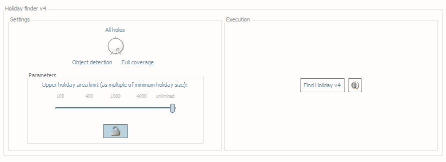
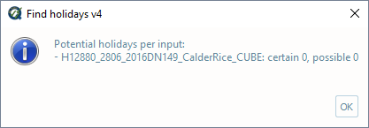
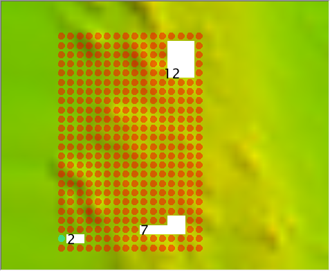
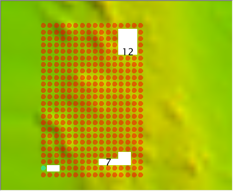

.. _survey-detect-holidays:

Detect holidays
---------------

.. index::
    single: holidays

How To Use?
^^^^^^^^^^^    

.. index::
    single: holidays; coverage

Scan grids for unpopulated nodes ("holidays").

* Select the **Detect holidays** tab (:numref:`fig_detect_holidays`) on the bottom of the QC Tools interface.

* In **Parameters**, turn the knob to select **All holes**, **Object detection**, or **Full coverage**, depending on the analysis you wish to run based on the coverage requirements of the survey (see 2.2.4.2 How does it work?)

* To change the **Parameters** for **Holiday finder v4**:

    * Click the **Unlock** button, and click **OK** to the dialogue.
    * Set the **Upper holiday area limit (as multiple of minimum holiday size)**. Unpopulated parts of the grid larger than this setting will not be flagged as holidays.

* In **Execution**, click **Find Holiday v4**.

.. _fig_detect_holidays:

    The **Detect holidays** tab.

* After computing, the output window opens automatically, and the results are shown (:numref:`fig_detect_holidays_output`).

.. _fig_detect_holidays_output:

    The output message at the end of **Find holiday v4** execution.

* An output window will open in File Explorer. From the output window, drag-and-drop the desired output file into the processing software to guide the review.

* The output file names adopt the following convention:

    * [grid filename].HFv4.["all" for *All holes* | "obj" for *Object detection* | "cov" for *Full coverage*].[min size]

.. note::
    For proper visualization, the software adopted to analyze the S57 output of VALSOU Checks has to represent the sounding values in meters.

|

-----------------------------------------------------------

|

How Does It Work?
^^^^^^^^^^^^^^^^^

The grid is scanned, and any empty grid nodes ("holes") surrounded by populated nodes are identified. These are flagged as holidays based on 2018 NOAA NOS Hydrographic Survey Specifications and Deliverables.

The specifications have different criteria by which holidays are defined based on coverage requirements:

* A holiday under **Object Detection** coverage requirements is defined as collinear, contiguous unpopulated nodes sharing adjacent sides.

* A holiday under **Full Coverage** requirements is defined as a box of unpopulated nodes.

* There is also the option to simply flag all unpopulated nodes as holidays, by selecting the **All holes** setting.

The holiday size is calculated in number of nodes based on the minimum allowable resolution and the grid resolution.

Only in the case of a variable resolution input, all the tiles are re-sampled to create a single resolution grid (selecting the highest resolution among all the grid tiles).

The minimum allowable resolution is calculated based on the median value of all the node depths belonging to the holiday perimeter.

.. note::
    The output of Holiday Finder is a sounding, with a value of "1" for certain holidays, and "2" for possible holidays.

The following images illustrate the outcomes of the three algorithms applied to a single-resolution grid (with the minimum allowable resolution equals to the grid resolution):

* In the example in (:numref:`all_holes`), the **All holes** setting marks three holes of 12, 7, and 2 nodes.

.. _all_holes:

    Example for All holes.

* In the example in (:numref:`object_detection`), Object Detection requirements identify the holes of 12 and 7 nodes, because each has 3 collinear, contiguous unpopulated nodes. The hole with 2 grids does not.

.. _object_detection:

    Example for Object detection.

* In the example in (:numref:`full_coverage`), Full Coverage requirements identify the hole of 12 grid nodes, because there it contains an instance of 3x3 unpopulated grid nodes. The holes with 7 and 2 nodes do not.

.. _full_coverage:
.. figure:: _static/full_coverage.png
    :align: center
    :alt: logo

    Example for Full coverage.

A candidate hole is flagged with a "1" (if certain) or a "2" (possible holiday).

Note that the default **Upper holiday area limit (as multiple of minimum holiday size)** is set to unlimited, meaning that an unpopulated part of the grid will be flagged independently of its size. This setting exists so the search can be refined at the user's discretion.

For example:

* If desired to search for only the smallest of holidays, the **Upper holiday area limit** might be set at **100**.

* If desired to flag all unpopulated parts of the grid, regardless of their size, the **Upper limit** would be set at **unlimited**.

* Settings in between are used at the discretion of the user, to identify holidays, while also preventing undue clutter in the output.
