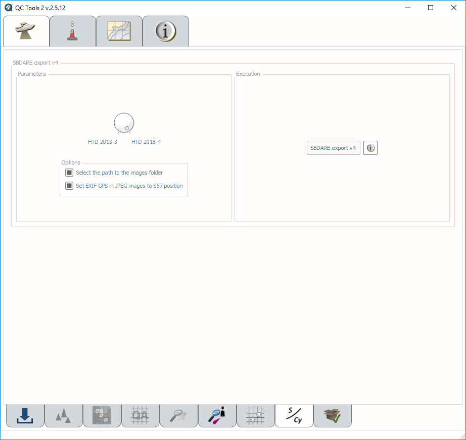
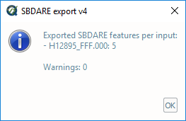

.. _survey-sbdare-export:

SBDARE export
-------------

Generates a text file and shape file for archival that includes, if available, linked bottom sample images and a translation
of the S-57 attribution to the Coastal and Marine Ecological Classification Standard (CMECS).

In order to access this tool, load a grid and an S-57 file into the **Data Inputs** tab. 

.. index::
    single: SBDARE export

How to Use?
^^^^^^^^^^^

* Select the **SBDARE export** tab on the bottom of the QC Tools interface.

* In **Parameters**:

  * Turn the knob to select applicable HTD.

  * If HTD 2018-4 is selected, you may set the images folder path by checking set **Select the path to the images folder** option. If unset, the default search is in the input feature file folder.

  * Flag **Set the EXIF GPS in JPEG image to S57 position** to include or overwrite the location of the bottom sample in the image metadata based on the S-57 feature file.

* Click **SBDARE export v4** (:numref:`sbdare_export_interface`).

.. _sbdare_export_interface:

    SBDARE exports interface.

* After computing, the output window opens automatically, and the results are shown. Any errors that occur while processing will appear in the output message. (:numref:`sbdare_results`):

.. _sbdare_results:

    SBDARE exports output message.

* The output is in the proper format for archival.

|

-----------------------------------------------------------

|

How Does It Work?
^^^^^^^^^^^^^^^^^

For both settings, SBDARE export selects only SBDARE point features in the feature file and exports them into the appropriate outputs per their respective HTD. 

When the toggle is set to the **HTD 2013-3**, SBDARE features are exported into a semicolon delimited ASCII with the following information: Latitude, Longitude, Observed time, Colour, Nature of surface - qualifying terms, Nature of surface; Remarks, Source date, and Source indication. 

When the toggle is set to the **HTD 2014-4**, SBDARE features are exported into two different files: a semicolon delimited ASCII and a shape file. 

Both the semicolon delimited ASCII file and the shape file contain the following information: Latitude, Longitude, Observed time, Colour, Nature of surface - qualifying terms, Nature of surface, Remarks, Source date, Source indication, Images, CMECS Co-occurring Element 1 Name, and CMECS Co-occurring Element 1 Code, CMECS Co-occurring Element 2 Name, and CMECS Co-occurring Element 2 Code.

**Colour**, **Nature of surface - qualifying terms** (NATSUR), and **Nature of surface** (NATQUA) are all limited to three or fewer terms. If the feature file contains more than three terms per attribute, the first three are selected. Additionally, only a maximum of four **images** are allowed per feature. If there are more than four images for a feature, the first four are selected for export. 

If **"Set EXIF GPS in JPEG images to S57 position"** is selected, all associated images will have the GPS metadata in the JPEG file match the location of the bottom sample in the feature file. This allows future users to utilize these images in GIS software as they are geotagged. 

SBDARE export translates the **NATSUR** and **NATQUA** to the appropriate Coastal and Marine Ecological Classification Standard June 2012 (**CMECS**) standard. A crosswalk table used for this classification can be found in Appendix E of HTD 2018-4 Bottom Sample Drop Camera Imagery. 

A zip file is created containing the shape file and "Images" folder with the images. If no images are available, a text file is created indication that the image folder is intentionally left empty. 
