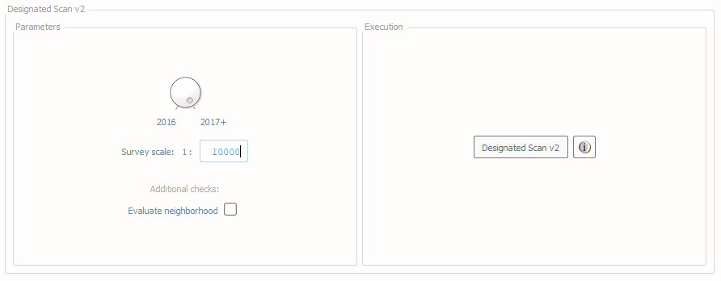
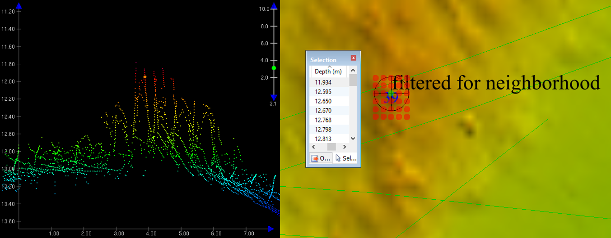
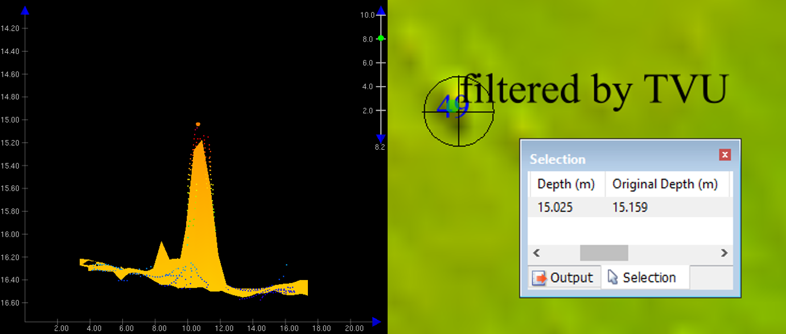
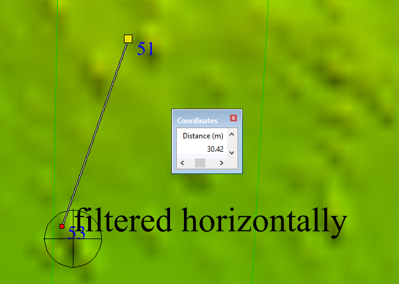

.. _survey-scan-designated-label:

Scan Designated
---------------

.. index::
    single: scan designated

How To Use?
^^^^^^^^^^^    
    
Scans grids to ensure the validity of any soundings designated. Currently, only **Single-Resolution BAG** files are supported.

In order to access this tool, load a BAG and an S-57 file into the **Data Inputs** tab. 

* Select the **Scan Designated** tab (:numref:`fig_scan_designated`) on the bottom of the QC Tools interface.

.. index::
    single: scan designated

* In **Parameters**: 

    * Turn the knob to select the applicable year as pertaining to required NOAA NOS Hydrographic Survey Specifications and Deliverables (HSSD).
    * Enter the **Survey scale**. Any designated soundings that have a more shoal designated sounding within 2mm at survey scale will be flagged as invalid.
    * If desired, check the box **Evaluate neighborhood** as an estimate of designated sounding height 1 meter off the seafloor. Note this is a subjective check to be overrided by the hydrographer's discretion.

* In **Execution**, click **Designated Scan v2**.

.. _fig_scan_designated:

    The **Scan Designated** tab.

* After computing, the output window opens automatically.

.. index::
    single: drag-and-drop

* From the output window, drag-and-drop the output into the processing software to guide the review.

* The output names adopt the following convention:

    * [grid filename].[s57 filename].DESIGNATED_SCAN_v2.[HSSD year]

|

-----------------------------------------------------------

|

How Does It Work?
^^^^^^^^^^^^^^^^^

The grid is scanned to ensure the validity of designated soundings per NOAA NOS HSSD. According to the HSSD 2018 (see, 5.2.1.2.3), a designated sounding need not be created unless the following conditions are true:

1. The top of the natural topography is greater than 1m proud of the surrounding seafloor. 

As shown in the example in :numref:`ex3_ds`, the designated sounding appears less than 1 meter off the seafloor when viewed in both sounding and grid data. This check is not definitive, however, and should only be used if useful. The hydrographer's discretion may override the output.

.. _ex3_ds:

    Example of possible unnecessary designation.

2. The difference between the gridded surface and potential designated sounding is greater than the allowable TVU at that depth: 
	
    * half the allowable TVU (in depths < 20 meters) or the full allowable TVU (in depths >= 20 meters) *[2016]*.
    * the full allowable TVU *[2017]*.

The grid nodes are scanned and any node with a depth adjusted by designated sounding is checked to ensure that the difference between the original depth and the new depth (i.e. the designated depth) meet the requirement as related to TVU.

As shown in the example in :numref:`ex1_ds`, the vertical distance between the grid and the designated sounding (0.134 m) is less than half the allowable TVU for this depth (0.269 m based on HSSD 2016), thus designation of this sounding was not necessary.

.. _ex1_ds:

    Second example of unnecessary designation.

3. In addition, no sounding shall be designated that is within 2 mm at the scale of the survey (i.e., 20 m for 1:10,000 scale) of another shoaler sounding.

As shown in the example in :numref:`ex2_ds`, at the survey scale of 1:20,000, there is a more shoal sounding designated (51 feet) approximately 31 meters away, which is within 2mm at survey scale (40 meters), thus the designated sounding of 53 feet is not necesssary.

.. _ex2_ds:

    Third example of unnecessary designation.

4. Finally, a designated sounding is valid if a feature exists within 1 grid node and that feature has a VALSOU value within 1 centimeter of difference from the designated sounding depth.