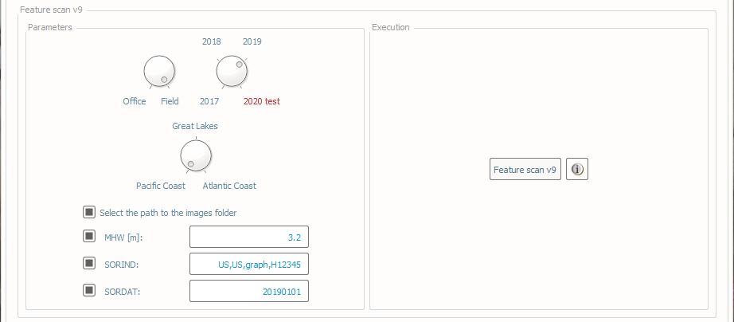
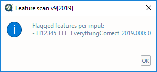
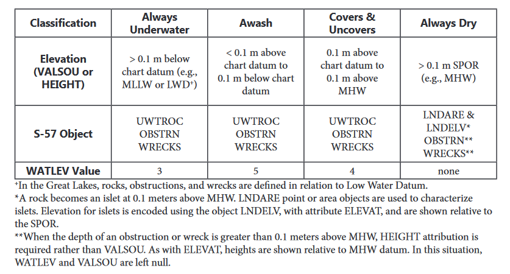

.. _survey-scan-features:

Scan features
-------------

.. index::
    single: features

How To Use?
^^^^^^^^^^^

Scan features to ensure proper attribution.

In order to access this tool, load an S-57 file into the **Data Inputs** tab. 

* Select the **Scan features** tab (:numref:`fig_feature_scan`) on the bottom of the QC Tools interface.

* In **Parameters**:

  #. Turn the knob to select either the **Office** or **Field** profile.

  #. Turn the knob to select the applicable year as pertaining to required HSSD.

  #. Turn the knob to select the applicable location. (This effects the definition of WATLEV per the 2018 HSSD.)

  #. When **Select the path to the images folder** is set, the user can navigate to their multimedia or images folder upon execution of the tool. When this is unchecked, Feature scan will search in the relative path that the feature file is located. 
  
  #. **MHW** value is required to check proper attribution of WATLEV per the HSSD. Enter MHW value as a positive number.

  #. When **SORIND** and **SORDAT** are set, the entered values are compared to the attribution of new and updated features.

.. index::
    single: feature scan

* In **Execution**, click **Feature scan v9** (note that the '2020 test' option is used to experiment with future
  requirements).

.. _fig_feature_scan:

    The **Scan features** tab.

* After computing, the output window opens automatically, the results are shown(:numref:`fig_feature_scan_output`).

.. _fig_feature_scan_output:

    The output message at the end of **Feature scan** execution.

* From the output window, drag-and-drop the output file(s) into the processing software to guide the review.

* In addition, the results are printed to PDF for a documented summary.

|

-----------------------------------------------------------

|

How Does It Work?
^^^^^^^^^^^^^^^^^

The S-57 features are scanned to ensure proper attribution per the required year of HSSD.

The logic for the 2019 QC Tools feature scan is shown below. For previous years, refer to the HSSD for that year.

* Check to ensure no feature redundancy.
* All new and updated features except **"$AREAS", "$LINES", "$CSYMB", "$COMPS",** and **"$TEXTS"**.
    * Must have **"SORIND"** and **"SORDAT"** and that they are in the proper formats.
    * Check for agreement of **"SORIND"** and **"SORDAT"** values when entered in the Parameters.
* Assigned features = all features with **"asgnmt"** = 2.
    * All Assigned features must have **"descrp"** and **"remrks".**
* New or Deleted features = all features with **"descrp"** = 1 or 3.
    * All New or Deleted features must have **"remrks"** and **"recomd".**
* Sounding features = all **SOUNDG.**
    * All Sounding features must have **"TECSOU"** and **"QUASOU".**
* DTONs = all features with **"descrp"** = 1 or 2, **"sftype"** = 3.
    * All DTONs must have **"images".**
* Wrecks = all **WRECKS** with **"descrp"** = 1 or 2.
    * All Wrecks must have **"images", "CATWRK", "WATLEV", "VALSOU", "TECSOU",** and **"QUASOU".**
* Rocks = all **UWTROC** with **"descrp"** = 1 or 2.
    * All Rocks must have **"WATLEV", "VALSOU", "QUASOU",** and **"TECSOU".**
* Obstructions = all **OBSTRN** with **"descrp"** = 1 or 2.
    * All Obstructions must have **"images", "WATLEV", "VALSOU", "QUASOU",** and **"TECSOU".** [1]_
* Offshore platforms = all **OFSPLF** with **"descrp"** = 1 or 2.
    * All Offshore platforms must have **"images".**
* Seabed area points = all **SBDARE** with **point** geometry.
    * All Seabed area points must have **"NATSUR".**
    * All Seabed area points must have as many **"NATSUR"** attributes as **"NATQUA"** and/or **"COLOUR".**
    * All Seabed area points must have an allowable combination of **"NATSUR"** and **"NATQUA".** [2]_
* Seabed area lines and areas = all **SBDARE** with **line** or **area** geometry.
    * All Seabed area lines and areas must have **"NATSUR"** and **"WATLEV".**
* Additional:
    * All **MORFAC** must have **"CATMOR".**
    * All **COALNE** must have **"CATCOA".**
    * All **SLCONS** must have **"CATSLC".**
    * All **LNDELV** must have **"ELEVAT".**
* Additionally, if MHW flag is set, all features with **VALSOU** are checked for valid value and proper **WATLEV** attribution. [3]_
* All features with **"ELEVAT"** are checked for valid value.
* All **M_COVR** must have **"CATCOV", "INFORM",** and **"NINFOM".**
* All **"images"** contain the correct naming convention and they have a corresponding image in the multimedia folder. 
* Specific for the Office Profile:
    * All features must have **"onotes".**
    * All features must have **"hsdrec".**
    * Checks for features that are prohibited by MCD (**"DRGARE", "LOGPON", "PIPARE", "PIPOHD", "PIPSOL", "DMPGRD" "LIGHTS", "BOYLAT", "BOYSAW", "BOYSPP", "DAYMAR", "FOGSIG", "CBLSUB", "CBLARE", "FAIRWY", "RTPBCN", "BOYISD", "BOYINB", "BOYCAR", "CBLOHD", "OBSTRN"** with **"CATOBS"** = 5, **MORFAC** with **CATMOR** = 7.
    * All **M_QUAL** features must have **"CATZOC", "SURSTA", "SUREND",** and **"TECSOU".**
    * All features must have **"descrp"** and **remrks"**.

.. rubric:: Footnotes

.. [1] Obstructions of **"CATOBS"** = 6 (foul area) do not require **"images".** **VALSOU** is optional for line and area obstructions. Line and area obstructions of **"CATOBS"** = 6 (foul area) should not have **"VALSOU"**.
.. [2] Allowable combinations of **"NATSUR"** and **"NATQUA"** are shown below.

+----------+---+---+---+---+---+---+---+---+---+---+
|**NATQUA**| 1 | 2 | 3 | 4 | 5 | 6 | 7 | 8 | 9 | 10|
+-----+----+---+---+---+---+---+---+---+---+---+---+
|     |  1 |   |   |   |   | o | o | o | o | o | o |
+     +----+---+---+---+---+---+---+---+---+---+---+
|     |  2 |   |   |   |   | o | o | o |   |   | o |
+     +----+---+---+---+---+---+---+---+---+---+---+
|     |  3 |   |   |   |   | o | o | o |   |   | o |
+     +----+---+---+---+---+---+---+---+---+---+---+
|**N**|  4 | o | o | o |   |   | o |   | o | o | o |
+     +----+---+---+---+---+---+---+---+---+---+---+
|**A**|  5 |   |   |   |   |   |   |   | o | o |   |
+     +----+---+---+---+---+---+---+---+---+---+---+
|**T**|  6 |   |   |   |   |   |   |   | o | o |   |
+     +----+---+---+---+---+---+---+---+---+---+---+
|**S**|  7 |   |   |   |   |   |   |   | o | o |   |
+     +----+---+---+---+---+---+---+---+---+---+---+
|**U**|  8 |   |   |   |   |   |   |   | o | o |   |
+     +----+---+---+---+---+---+---+---+---+---+---+
|**R**|  9 |   |   |   |   |   |   |   | o | o |   |
+     +----+---+---+---+---+---+---+---+---+---+---+
|     | 11 |   |   |   |   |   |   |   | o |   |   |
+     +----+---+---+---+---+---+---+---+---+---+---+
|     | 14 |   |   |   | o |   |   |   |   |   |   |
+     +----+---+---+---+---+---+---+---+---+---+---+
|     | 17 |   |   |   | o |   |   |   |   | o |   |
+     +----+---+---+---+---+---+---+---+---+---+---+
|     | 18 |   |   |   |   |   |   |   | o | o |   |
+-----+----+---+---+---+---+---+---+---+---+---+---+

**NATQUA**: fine (1), medium (2), coarse(3), broken (4), sticky (5) soft (6), stiff (7), volcanic (8), calcareous (9), hard (10)

**NATSUR**: mud (1), clay (2), silt (3), sand (4), stone (5), gravel (6), pebbles (7), cobbles (8), rock (9), lava (11), coral (14), shells (17), boulder (18)

.. [3] Allowable combinations of **"WATLEV"** per **"VALSOU"** depending on location are shown below as stated in Appendix E in the 2019 Hydrographic Specifications and Deliverables.

.. _fig_WATLEV_attribution:

