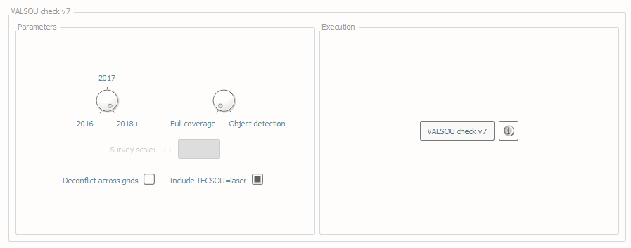
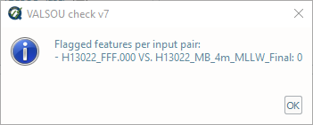

.. _survey-valsou-checks:

VALSOU checks
-------------

.. index::
    single: VALSOU
    
How To Use?
^^^^^^^^^^^

Ensure surveyed features are properly accounted for in the gridded bathymetry.

In order to access this tool, load a grid and an S-57 file into the **Data Inputs** tab. 

* Select the **VALSOU check** tab (:numref:`fig_valsou_check`) on the bottom of the QC Tools interface.

.. index::
    single: VALSOU checks

* In **Parameters**:

    * Turn the knob to select the applicable year as pertaining to required HSSD.
    * Turn the knob to select the survey mode: **Full coverage** or **Object detection**.
    * For 2016 and 2017, enter in the applicable survey scale (e.g. 10,000 or 20,000, etc.).
    * The **Deconflict across grids** checkbox may be enabled if the grids that are loaded have overlaps. If a feature has no grid data directly underneath, the nodes of the other grids in memory will be searched to find a valid match.
    * The **Include TECSOU=laser** checkbox may be enabled (in the event of lidar bathymetry wherein we'd expect features to be represented in the grid), or disabled (as in the case of shoreline investigations wherein we'd not have this expectation).

.. note::
	There are currently not differences between the checks applied for NOAA NOS HSSD 2016 and 2017. Survey scale is no longer needed in 2018 as all VALSOUs must agree with corresponding grids.

* In **Execution**, click **VALSOU check v7**

.. _fig_valsou_check:

    The **VALSOU check** tab.

* After computing, the output window opens automatically, and the results are shown (:numref:`fig_valsou_check_output`).
  Note, the check considers all combination of grids and features files loaded. If there is no overlap found between a grid and feature file,
  no output is generated, and the summary will report "no overlap".

.. _fig_valsou_check_output:

    The output message at the end of **VALSOU check v7** execution.

* From the output window, drag-and-drop the output into the processing software to guide the review.

* The output names adopt the following convention:

    * [grid].[s57].VCv7.[version].[".las" -> **Include TECSOU=laser**][".dec" -> deconfliction]["od"|"fc" -> mode]

|

-----------------------------------------------------------

|

How Does It Work?
^^^^^^^^^^^^^^^^^

The grid is scanned for features expected to be represented in the grid as per specification. These features are new or updated wrecks, rocks, and obstructions, and a grid node should be found that agrees with the feature VALSOU.

.. note::
	If the input grid files follow the NOAA OCS naming convention (e.g., having "_1m_" in the filename), this information is retrieved and used to only evaluate the features with VALSOU value in the corresponding validity range (e.g., 0 - 20 m).
